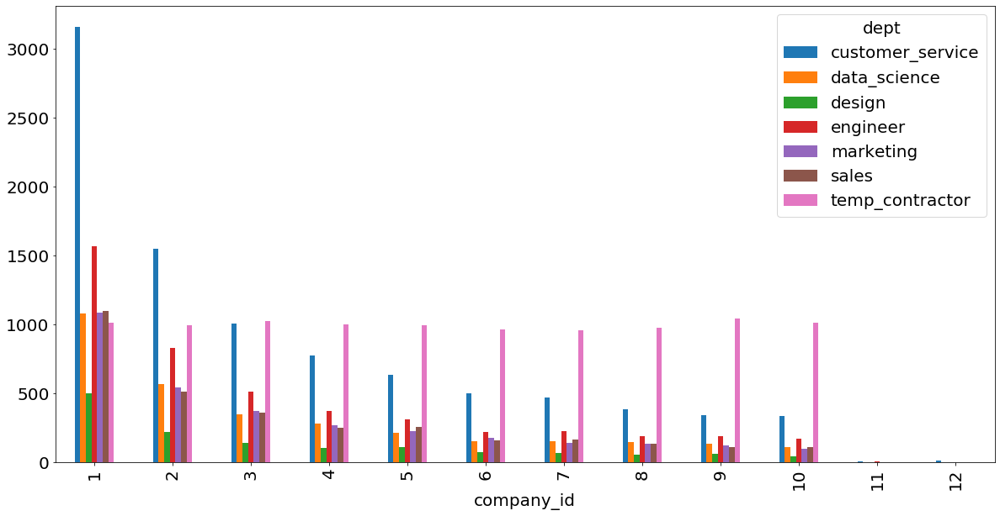
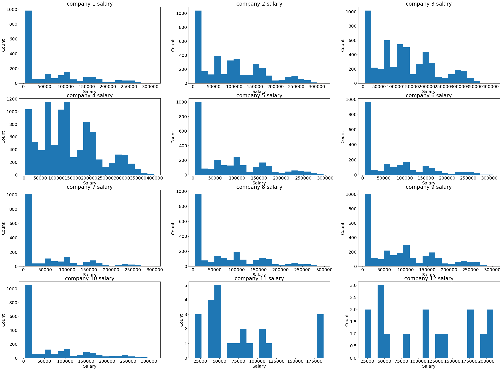
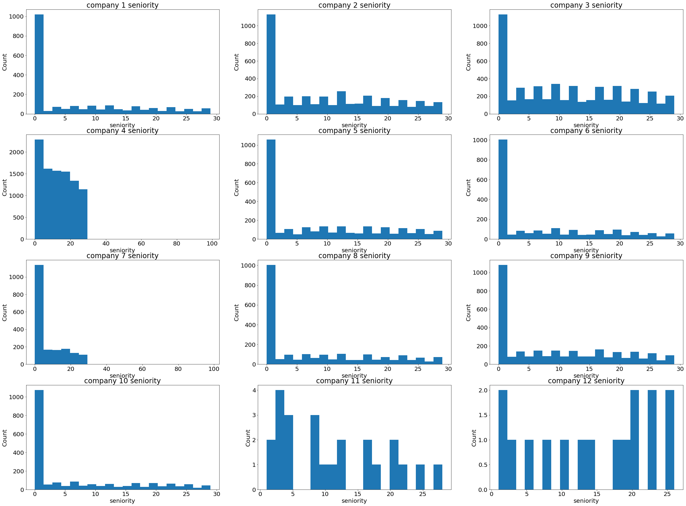
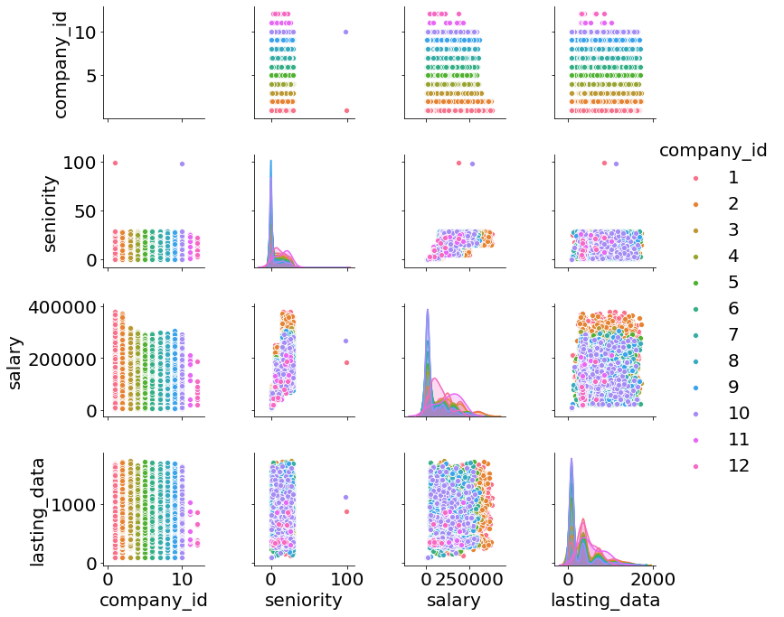
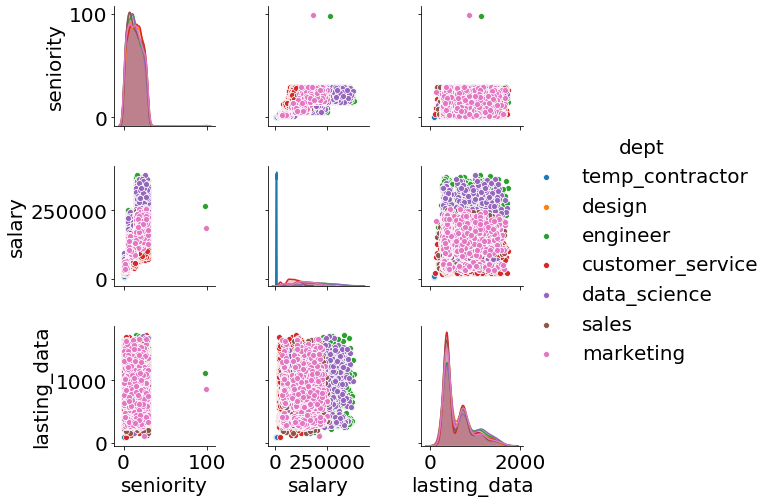
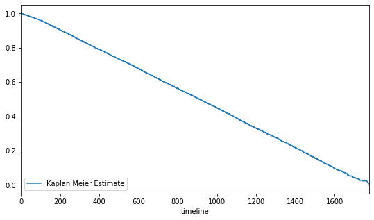
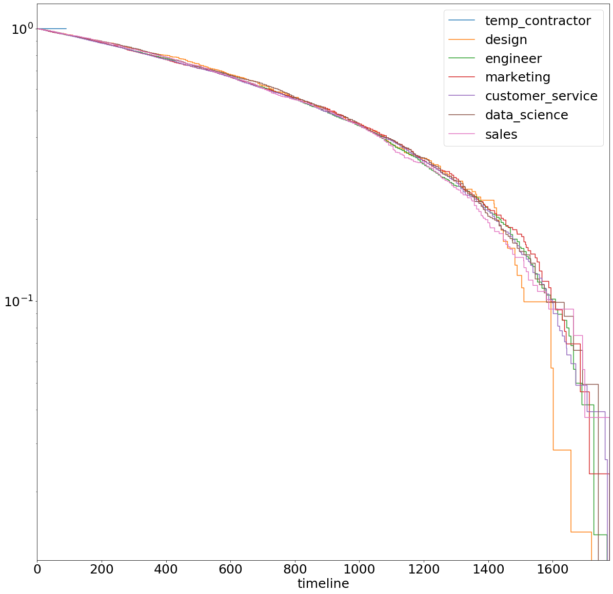
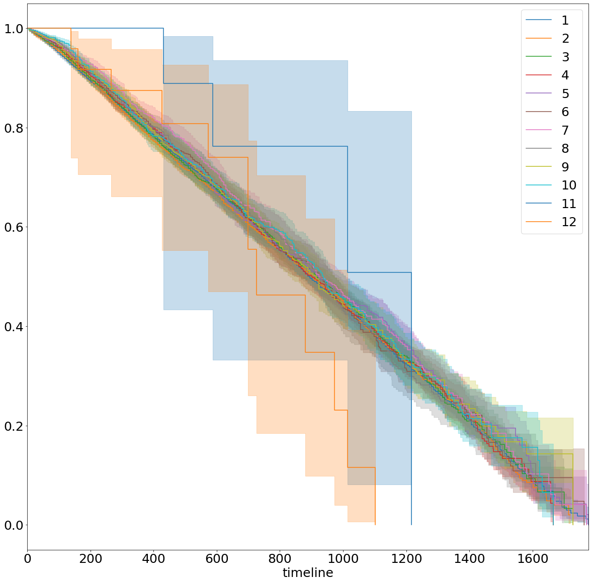
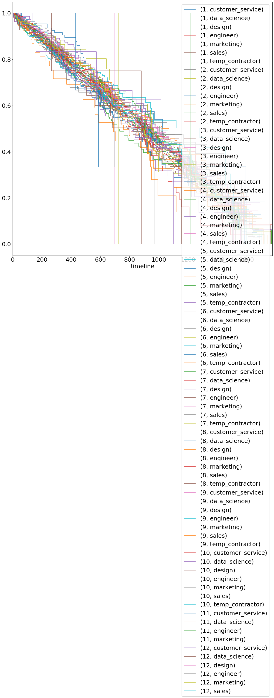

# SurvivalAnalysis
NOTE: github's rendering in notebook doesn't always work, if the ipynb file doesn't load, you can see it in https://nbviewer.jupyter.org/github/YIZHE12/SurvivalAnalysis/blob/master/EDA_survival_analysis.ipynb


## Background:
Your team has been tasked with diagnosing why and when employees from your subsidiaries leave.

You need a tangible data-driven recommendation for each of the ten Presidents of your subsidiaries.

What are your recommendations and why?

### Quick look:
This is a survival analysis tasks that I solved using Kaplan Meier plot and Cox Proportional-Hazards Model. There are some data cleaning to do as the datedata is several formats. There are also outliers in the data. For examples, two data points have seniority of 90 years which is not likely as we don't expect someone who have worked for 90 years. For more information, you can have a look at the pdf file in the repo.

The notebook here included all the analysis. The data is the txt file uploaded.

### Prerequisites
pandas, numpy, lifelines, matplotlib, seaborn
```
pip install numpy
pip install pandas
pip install matplotlib
pip install seaborn
pip install lifelines
```

### The notebook:


```python
import os
import pandas as pd
import datetime
import matplotlib.pyplot as plt
import seaborn as sns
import matplotlib
import numpy as np
```


```python
matplotlib.rcParams.update({'font.size': 20})
```


```python
data = pd.read_csv('employee_retention.txt', index_col = 'Unnamed: 0')
```


```python
data.head(5)
```


<div>
<style scoped>
    .dataframe tbody tr th:only-of-type {
        vertical-align: middle;
    }

    .dataframe tbody tr th {
        vertical-align: top;
    }

    .dataframe thead th {
        text-align: right;
    }
</style>
<table border="1" class="dataframe">
  <thead>
    <tr style="text-align: right;">
      <th></th>
      <th>employee_id</th>
      <th>company_id</th>
      <th>dept</th>
      <th>seniority</th>
      <th>salary</th>
      <th>join_date</th>
      <th>quit_date</th>
    </tr>
  </thead>
  <tbody>
    <tr>
      <th>0</th>
      <td>1001444.0</td>
      <td>8</td>
      <td>temp_contractor</td>
      <td>0</td>
      <td>5850.0</td>
      <td>2008-01-26</td>
      <td>2008-04-25</td>
    </tr>
    <tr>
      <th>1</th>
      <td>388804.0</td>
      <td>8</td>
      <td>design</td>
      <td>21</td>
      <td>191000.0</td>
      <td>05.17.2011</td>
      <td>2012-03-16</td>
    </tr>
    <tr>
      <th>2</th>
      <td>407990.0</td>
      <td>3</td>
      <td>design</td>
      <td>9</td>
      <td>90000.0</td>
      <td>2012-03-26</td>
      <td>2015-04-10</td>
    </tr>
    <tr>
      <th>3</th>
      <td>120657.0</td>
      <td>2</td>
      <td>engineer</td>
      <td>20</td>
      <td>298000.0</td>
      <td>2013-04-08</td>
      <td>2015-01-30</td>
    </tr>
    <tr>
      <th>4</th>
      <td>1006393.0</td>
      <td>1</td>
      <td>temp_contractor</td>
      <td>0</td>
      <td>8509.0</td>
      <td>2008-07-20</td>
      <td>2008-10-18</td>
    </tr>
  </tbody>
</table>
</div>


```python
data.info()
```

    <class 'pandas.core.frame.DataFrame'>
    Int64Index: 34702 entries, 0 to 34701
    Data columns (total 7 columns):
    employee_id    34702 non-null float64
    company_id     34702 non-null int64
    dept           34702 non-null object
    seniority      34702 non-null int64
    salary         34463 non-null float64
    join_date      34702 non-null object
    quit_date      23510 non-null object
    dtypes: float64(2), int64(2), object(3)
    memory usage: 2.1+ MB


There are less data in the quit_date, this is because these people are not quite yet

Some salary data is missing

But maybe for the first survivol analysis we can do without

Notice the date has different formats:
05.17.2011	2012-03-16

# Data cleaning


```python
data.join_date = pd.to_datetime(data.join_date)
data.quit_date = pd.to_datetime(data.quit_date)

# data.quit_date = data.quit_date.fillna(value=datetime.date.today())
```


```python
data.quit_date.max()
```


    Timestamp('2015-12-09 00:00:00')


```python
data.join_date.max()
```


    Timestamp('2015-12-10 00:00:00')


```python
data.employee_id = data.employee_id.astype('int32')
```


```python
len(data.employee_id.unique()) # check if there is replicate
```


    34702


```python
len(data.company_id.unique()) 
```


    12


```python
data.dept.unique()
```


    array(['temp_contractor', 'design', 'engineer', 'marketing',
           'customer_service', 'data_science', 'sales'], dtype=object)


Does every company has the all these departments?


```python
for i in range(len(data.company_id.unique())):
    print(i+1, data[data.company_id == i+1].dept.unique(), len(data[data.company_id == i+1].dept.unique()))
```

    1 ['temp_contractor' 'customer_service' 'engineer' 'sales' 'data_science'
     'marketing' 'design'] 7
    2 ['engineer' 'data_science' 'design' 'temp_contractor' 'sales'
     'customer_service' 'marketing'] 7
    3 ['design' 'customer_service' 'data_science' 'sales' 'temp_contractor'
     'marketing' 'engineer'] 7
    4 ['temp_contractor' 'data_science' 'marketing' 'customer_service'
     'engineer' 'design' 'sales'] 7
    5 ['marketing' 'sales' 'temp_contractor' 'customer_service' 'data_science'
     'design' 'engineer'] 7
    6 ['marketing' 'temp_contractor' 'engineer' 'design' 'customer_service'
     'data_science' 'sales'] 7
    7 ['data_science' 'design' 'temp_contractor' 'customer_service' 'engineer'
     'marketing' 'sales'] 7
    8 ['temp_contractor' 'design' 'customer_service' 'engineer' 'sales'
     'marketing' 'data_science'] 7
    9 ['temp_contractor' 'customer_service' 'engineer' 'sales' 'data_science'
     'marketing' 'design'] 7
    10 ['data_science' 'temp_contractor' 'marketing' 'customer_service'
     'engineer' 'sales' 'design'] 7
    11 ['engineer' 'customer_service' 'marketing' 'data_science'] 4
    12 ['data_science' 'engineer' 'customer_service' 'marketing' 'sales' 'design'] 6


How many examples each companies have, and for which department?


```python
count_company = data.groupby('company_id').count()
count_company
```


<div>
<style scoped>
    .dataframe tbody tr th:only-of-type {
        vertical-align: middle;
    }

    .dataframe tbody tr th {
        vertical-align: top;
    }

    .dataframe thead th {
        text-align: right;
    }
</style>
<table border="1" class="dataframe">
  <thead>
    <tr style="text-align: right;">
      <th></th>
      <th>employee_id</th>
      <th>dept</th>
      <th>seniority</th>
      <th>salary</th>
      <th>join_date</th>
      <th>quit_date</th>
    </tr>
    <tr>
      <th>company_id</th>
      <th></th>
      <th></th>
      <th></th>
      <th></th>
      <th></th>
      <th></th>
    </tr>
  </thead>
  <tbody>
    <tr>
      <th>1</th>
      <td>9501</td>
      <td>9501</td>
      <td>9501</td>
      <td>9423</td>
      <td>9501</td>
      <td>5636</td>
    </tr>
    <tr>
      <th>2</th>
      <td>5220</td>
      <td>5220</td>
      <td>5220</td>
      <td>5178</td>
      <td>5220</td>
      <td>3204</td>
    </tr>
    <tr>
      <th>3</th>
      <td>3773</td>
      <td>3773</td>
      <td>3773</td>
      <td>3748</td>
      <td>3773</td>
      <td>2555</td>
    </tr>
    <tr>
      <th>4</th>
      <td>3066</td>
      <td>3066</td>
      <td>3066</td>
      <td>3046</td>
      <td>3066</td>
      <td>2157</td>
    </tr>
    <tr>
      <th>5</th>
      <td>2749</td>
      <td>2749</td>
      <td>2749</td>
      <td>2734</td>
      <td>2749</td>
      <td>1977</td>
    </tr>
    <tr>
      <th>6</th>
      <td>2258</td>
      <td>2258</td>
      <td>2258</td>
      <td>2243</td>
      <td>2258</td>
      <td>1679</td>
    </tr>
    <tr>
      <th>7</th>
      <td>2185</td>
      <td>2185</td>
      <td>2185</td>
      <td>2170</td>
      <td>2185</td>
      <td>1653</td>
    </tr>
    <tr>
      <th>8</th>
      <td>2026</td>
      <td>2026</td>
      <td>2026</td>
      <td>2011</td>
      <td>2026</td>
      <td>1558</td>
    </tr>
    <tr>
      <th>9</th>
      <td>2005</td>
      <td>2005</td>
      <td>2005</td>
      <td>1998</td>
      <td>2005</td>
      <td>1573</td>
    </tr>
    <tr>
      <th>10</th>
      <td>1879</td>
      <td>1879</td>
      <td>1879</td>
      <td>1873</td>
      <td>1879</td>
      <td>1494</td>
    </tr>
    <tr>
      <th>11</th>
      <td>16</td>
      <td>16</td>
      <td>16</td>
      <td>16</td>
      <td>16</td>
      <td>12</td>
    </tr>
    <tr>
      <th>12</th>
      <td>24</td>
      <td>24</td>
      <td>24</td>
      <td>23</td>
      <td>24</td>
      <td>12</td>
    </tr>
  </tbody>
</table>
</div>


company 11 and 12 have too few data points!


```python
count_department = data.groupby(['company_id', 'dept']).count()
count_department
```


<div>
<style scoped>
    .dataframe tbody tr th:only-of-type {
        vertical-align: middle;
    }

    .dataframe tbody tr th {
        vertical-align: top;
    }

    .dataframe thead th {
        text-align: right;
    }
</style>
<table border="1" class="dataframe">
  <thead>
    <tr style="text-align: right;">
      <th></th>
      <th></th>
      <th>employee_id</th>
      <th>seniority</th>
      <th>salary</th>
      <th>join_date</th>
      <th>quit_date</th>
    </tr>
    <tr>
      <th>company_id</th>
      <th>dept</th>
      <th></th>
      <th></th>
      <th></th>
      <th></th>
      <th></th>
    </tr>
  </thead>
  <tbody>
    <tr>
      <th rowspan="7" valign="top">1</th>
      <th>customer_service</th>
      <td>3157</td>
      <td>3157</td>
      <td>3129</td>
      <td>3157</td>
      <td>1803</td>
    </tr>
    <tr>
      <th>data_science</th>
      <td>1079</td>
      <td>1079</td>
      <td>1070</td>
      <td>1079</td>
      <td>565</td>
    </tr>
    <tr>
      <th>design</th>
      <td>499</td>
      <td>499</td>
      <td>491</td>
      <td>499</td>
      <td>269</td>
    </tr>
    <tr>
      <th>engineer</th>
      <td>1568</td>
      <td>1568</td>
      <td>1552</td>
      <td>1568</td>
      <td>748</td>
    </tr>
    <tr>
      <th>marketing</th>
      <td>1085</td>
      <td>1085</td>
      <td>1075</td>
      <td>1085</td>
      <td>620</td>
    </tr>
    <tr>
      <th>sales</th>
      <td>1098</td>
      <td>1098</td>
      <td>1091</td>
      <td>1098</td>
      <td>616</td>
    </tr>
    <tr>
      <th>temp_contractor</th>
      <td>1015</td>
      <td>1015</td>
      <td>1015</td>
      <td>1015</td>
      <td>1015</td>
    </tr>
    <tr>
      <th rowspan="7" valign="top">2</th>
      <th>customer_service</th>
      <td>1548</td>
      <td>1548</td>
      <td>1530</td>
      <td>1548</td>
      <td>840</td>
    </tr>
    <tr>
      <th>data_science</th>
      <td>568</td>
      <td>568</td>
      <td>562</td>
      <td>568</td>
      <td>269</td>
    </tr>
    <tr>
      <th>design</th>
      <td>223</td>
      <td>223</td>
      <td>223</td>
      <td>223</td>
      <td>126</td>
    </tr>
    <tr>
      <th>engineer</th>
      <td>829</td>
      <td>829</td>
      <td>822</td>
      <td>829</td>
      <td>384</td>
    </tr>
    <tr>
      <th>marketing</th>
      <td>541</td>
      <td>541</td>
      <td>535</td>
      <td>541</td>
      <td>295</td>
    </tr>
    <tr>
      <th>sales</th>
      <td>513</td>
      <td>513</td>
      <td>508</td>
      <td>513</td>
      <td>292</td>
    </tr>
    <tr>
      <th>temp_contractor</th>
      <td>998</td>
      <td>998</td>
      <td>998</td>
      <td>998</td>
      <td>998</td>
    </tr>
    <tr>
      <th rowspan="7" valign="top">3</th>
      <th>customer_service</th>
      <td>1010</td>
      <td>1010</td>
      <td>1000</td>
      <td>1010</td>
      <td>545</td>
    </tr>
    <tr>
      <th>data_science</th>
      <td>347</td>
      <td>347</td>
      <td>345</td>
      <td>347</td>
      <td>194</td>
    </tr>
    <tr>
      <th>design</th>
      <td>141</td>
      <td>141</td>
      <td>141</td>
      <td>141</td>
      <td>81</td>
    </tr>
    <tr>
      <th>engineer</th>
      <td>516</td>
      <td>516</td>
      <td>512</td>
      <td>516</td>
      <td>292</td>
    </tr>
    <tr>
      <th>marketing</th>
      <td>372</td>
      <td>372</td>
      <td>367</td>
      <td>372</td>
      <td>214</td>
    </tr>
    <tr>
      <th>sales</th>
      <td>363</td>
      <td>363</td>
      <td>359</td>
      <td>363</td>
      <td>205</td>
    </tr>
    <tr>
      <th>temp_contractor</th>
      <td>1024</td>
      <td>1024</td>
      <td>1024</td>
      <td>1024</td>
      <td>1024</td>
    </tr>
    <tr>
      <th rowspan="7" valign="top">4</th>
      <th>customer_service</th>
      <td>777</td>
      <td>777</td>
      <td>769</td>
      <td>777</td>
      <td>415</td>
    </tr>
    <tr>
      <th>data_science</th>
      <td>279</td>
      <td>279</td>
      <td>277</td>
      <td>279</td>
      <td>161</td>
    </tr>
    <tr>
      <th>design</th>
      <td>107</td>
      <td>107</td>
      <td>106</td>
      <td>107</td>
      <td>61</td>
    </tr>
    <tr>
      <th>engineer</th>
      <td>376</td>
      <td>376</td>
      <td>375</td>
      <td>376</td>
      <td>208</td>
    </tr>
    <tr>
      <th>marketing</th>
      <td>269</td>
      <td>269</td>
      <td>263</td>
      <td>269</td>
      <td>157</td>
    </tr>
    <tr>
      <th>sales</th>
      <td>254</td>
      <td>254</td>
      <td>252</td>
      <td>254</td>
      <td>151</td>
    </tr>
    <tr>
      <th>temp_contractor</th>
      <td>1004</td>
      <td>1004</td>
      <td>1004</td>
      <td>1004</td>
      <td>1004</td>
    </tr>
    <tr>
      <th rowspan="2" valign="top">5</th>
      <th>customer_service</th>
      <td>635</td>
      <td>635</td>
      <td>631</td>
      <td>635</td>
      <td>355</td>
    </tr>
    <tr>
      <th>data_science</th>
      <td>216</td>
      <td>216</td>
      <td>213</td>
      <td>216</td>
      <td>114</td>
    </tr>
    <tr>
      <th>...</th>
      <th>...</th>
      <td>...</td>
      <td>...</td>
      <td>...</td>
      <td>...</td>
      <td>...</td>
    </tr>
    <tr>
      <th rowspan="6" valign="top">8</th>
      <th>data_science</th>
      <td>146</td>
      <td>146</td>
      <td>143</td>
      <td>146</td>
      <td>80</td>
    </tr>
    <tr>
      <th>design</th>
      <td>53</td>
      <td>53</td>
      <td>53</td>
      <td>53</td>
      <td>24</td>
    </tr>
    <tr>
      <th>engineer</th>
      <td>191</td>
      <td>191</td>
      <td>190</td>
      <td>191</td>
      <td>103</td>
    </tr>
    <tr>
      <th>marketing</th>
      <td>135</td>
      <td>135</td>
      <td>132</td>
      <td>135</td>
      <td>68</td>
    </tr>
    <tr>
      <th>sales</th>
      <td>137</td>
      <td>137</td>
      <td>136</td>
      <td>137</td>
      <td>85</td>
    </tr>
    <tr>
      <th>temp_contractor</th>
      <td>979</td>
      <td>979</td>
      <td>979</td>
      <td>979</td>
      <td>979</td>
    </tr>
    <tr>
      <th rowspan="7" valign="top">9</th>
      <th>customer_service</th>
      <td>342</td>
      <td>342</td>
      <td>341</td>
      <td>342</td>
      <td>186</td>
    </tr>
    <tr>
      <th>data_science</th>
      <td>134</td>
      <td>134</td>
      <td>133</td>
      <td>134</td>
      <td>71</td>
    </tr>
    <tr>
      <th>design</th>
      <td>60</td>
      <td>60</td>
      <td>58</td>
      <td>60</td>
      <td>41</td>
    </tr>
    <tr>
      <th>engineer</th>
      <td>188</td>
      <td>188</td>
      <td>185</td>
      <td>188</td>
      <td>106</td>
    </tr>
    <tr>
      <th>marketing</th>
      <td>124</td>
      <td>124</td>
      <td>124</td>
      <td>124</td>
      <td>62</td>
    </tr>
    <tr>
      <th>sales</th>
      <td>113</td>
      <td>113</td>
      <td>113</td>
      <td>113</td>
      <td>63</td>
    </tr>
    <tr>
      <th>temp_contractor</th>
      <td>1044</td>
      <td>1044</td>
      <td>1044</td>
      <td>1044</td>
      <td>1044</td>
    </tr>
    <tr>
      <th rowspan="7" valign="top">10</th>
      <th>customer_service</th>
      <td>336</td>
      <td>336</td>
      <td>333</td>
      <td>336</td>
      <td>190</td>
    </tr>
    <tr>
      <th>data_science</th>
      <td>109</td>
      <td>109</td>
      <td>108</td>
      <td>109</td>
      <td>52</td>
    </tr>
    <tr>
      <th>design</th>
      <td>41</td>
      <td>41</td>
      <td>41</td>
      <td>41</td>
      <td>23</td>
    </tr>
    <tr>
      <th>engineer</th>
      <td>172</td>
      <td>172</td>
      <td>171</td>
      <td>172</td>
      <td>94</td>
    </tr>
    <tr>
      <th>marketing</th>
      <td>96</td>
      <td>96</td>
      <td>96</td>
      <td>96</td>
      <td>56</td>
    </tr>
    <tr>
      <th>sales</th>
      <td>111</td>
      <td>111</td>
      <td>110</td>
      <td>111</td>
      <td>65</td>
    </tr>
    <tr>
      <th>temp_contractor</th>
      <td>1014</td>
      <td>1014</td>
      <td>1014</td>
      <td>1014</td>
      <td>1014</td>
    </tr>
    <tr>
      <th rowspan="4" valign="top">11</th>
      <th>customer_service</th>
      <td>6</td>
      <td>6</td>
      <td>6</td>
      <td>6</td>
      <td>3</td>
    </tr>
    <tr>
      <th>data_science</th>
      <td>2</td>
      <td>2</td>
      <td>2</td>
      <td>2</td>
      <td>2</td>
    </tr>
    <tr>
      <th>engineer</th>
      <td>6</td>
      <td>6</td>
      <td>6</td>
      <td>6</td>
      <td>5</td>
    </tr>
    <tr>
      <th>marketing</th>
      <td>2</td>
      <td>2</td>
      <td>2</td>
      <td>2</td>
      <td>2</td>
    </tr>
    <tr>
      <th rowspan="6" valign="top">12</th>
      <th>customer_service</th>
      <td>12</td>
      <td>12</td>
      <td>11</td>
      <td>12</td>
      <td>7</td>
    </tr>
    <tr>
      <th>data_science</th>
      <td>4</td>
      <td>4</td>
      <td>4</td>
      <td>4</td>
      <td>2</td>
    </tr>
    <tr>
      <th>design</th>
      <td>1</td>
      <td>1</td>
      <td>1</td>
      <td>1</td>
      <td>0</td>
    </tr>
    <tr>
      <th>engineer</th>
      <td>4</td>
      <td>4</td>
      <td>4</td>
      <td>4</td>
      <td>1</td>
    </tr>
    <tr>
      <th>marketing</th>
      <td>1</td>
      <td>1</td>
      <td>1</td>
      <td>1</td>
      <td>0</td>
    </tr>
    <tr>
      <th>sales</th>
      <td>2</td>
      <td>2</td>
      <td>2</td>
      <td>2</td>
      <td>2</td>
    </tr>
  </tbody>
</table>
<p>80 rows × 5 columns</p>
</div>


```python
fig, ax = plt.subplots(figsize=(20,10))

count_department['employee_id'].unstack().plot(ax=ax, kind = 'bar')
plt.savefig('stat.png')
```





```python
n_company = len(data.company_id.unique())
n_dept= len(data.dept.unique())
```


```python
companies = data.company_id.unique()
```


```python
plt.figure(figsize = (40, 30))
for i, company in enumerate(companies):
    plt.subplot(4,3,i+1)
    sns.distplot(data[data.company_id == company].salary.dropna(), norm_hist=False, kde=False, bins=20, \
                 hist_kws={"alpha": 1}).set(xlabel='Salary', ylabel='Count');
    plt.title('company '+str(i+1) + ' salary' )
#     sns.distplot(data[data.company_id == company].salary.dropna(),norm_hist=False)
plt.savefig('salary.png')
```





```python
plt.figure(figsize = (40, 30))
for i, company in enumerate(companies):
    plt.subplot(4,3,i+1)
    sns.distplot(data[data.company_id == company].seniority.dropna(), norm_hist=False, kde=False, bins=20, \
                 hist_kws={"alpha": 1}).set(xlabel='seniority', ylabel='Count');
    plt.title('company '+str(i+1) + ' seniority' )
#     sns.distplot(data[data.company_id == company].salary.dropna(),norm_hist=False)
plt.savefig('seniority.png')
```





Create another copy of data to do numerical EDA


```python
data_num = data.copy()
```


```python
data_num.head(5)
```


<div>
<style scoped>
    .dataframe tbody tr th:only-of-type {
        vertical-align: middle;
    }

    .dataframe tbody tr th {
        vertical-align: top;
    }

    .dataframe thead th {
        text-align: right;
    }
</style>
<table border="1" class="dataframe">
  <thead>
    <tr style="text-align: right;">
      <th></th>
      <th>employee_id</th>
      <th>company_id</th>
      <th>dept</th>
      <th>seniority</th>
      <th>salary</th>
      <th>join_date</th>
      <th>quit_date</th>
    </tr>
  </thead>
  <tbody>
    <tr>
      <th>0</th>
      <td>1001444</td>
      <td>8</td>
      <td>temp_contractor</td>
      <td>0</td>
      <td>5850.0</td>
      <td>2008-01-26</td>
      <td>2008-04-25</td>
    </tr>
    <tr>
      <th>1</th>
      <td>388804</td>
      <td>8</td>
      <td>design</td>
      <td>21</td>
      <td>191000.0</td>
      <td>2011-05-17</td>
      <td>2012-03-16</td>
    </tr>
    <tr>
      <th>2</th>
      <td>407990</td>
      <td>3</td>
      <td>design</td>
      <td>9</td>
      <td>90000.0</td>
      <td>2012-03-26</td>
      <td>2015-04-10</td>
    </tr>
    <tr>
      <th>3</th>
      <td>120657</td>
      <td>2</td>
      <td>engineer</td>
      <td>20</td>
      <td>298000.0</td>
      <td>2013-04-08</td>
      <td>2015-01-30</td>
    </tr>
    <tr>
      <th>4</th>
      <td>1006393</td>
      <td>1</td>
      <td>temp_contractor</td>
      <td>0</td>
      <td>8509.0</td>
      <td>2008-07-20</td>
      <td>2008-10-18</td>
    </tr>
  </tbody>
</table>
</div>


```python
# data_num.quit_date = data_num.quit_date.fillna(value=datetime.date.today())
```


```python
data_num = data_num.dropna()
```


```python
data_num.info()
```

    <class 'pandas.core.frame.DataFrame'>
    Int64Index: 23379 entries, 0 to 34701
    Data columns (total 7 columns):
    employee_id    23379 non-null int32
    company_id     23379 non-null int64
    dept           23379 non-null object
    seniority      23379 non-null int64
    salary         23379 non-null float64
    join_date      23379 non-null datetime64[ns]
    quit_date      23379 non-null datetime64[ns]
    dtypes: datetime64[ns](2), float64(1), int32(1), int64(2), object(1)
    memory usage: 1.3+ MB


```python
data_num['lasting_data'] = data_num.quit_date - data_num.join_date
data_num['lasting_data'] = data_num['lasting_data'].dt.days
data_num.head(5)
```


<div>
<style scoped>
    .dataframe tbody tr th:only-of-type {
        vertical-align: middle;
    }

    .dataframe tbody tr th {
        vertical-align: top;
    }

    .dataframe thead th {
        text-align: right;
    }
</style>
<table border="1" class="dataframe">
  <thead>
    <tr style="text-align: right;">
      <th></th>
      <th>employee_id</th>
      <th>company_id</th>
      <th>dept</th>
      <th>seniority</th>
      <th>salary</th>
      <th>join_date</th>
      <th>quit_date</th>
      <th>lasting_data</th>
    </tr>
  </thead>
  <tbody>
    <tr>
      <th>0</th>
      <td>1001444</td>
      <td>8</td>
      <td>temp_contractor</td>
      <td>0</td>
      <td>5850.0</td>
      <td>2008-01-26</td>
      <td>2008-04-25</td>
      <td>90</td>
    </tr>
    <tr>
      <th>1</th>
      <td>388804</td>
      <td>8</td>
      <td>design</td>
      <td>21</td>
      <td>191000.0</td>
      <td>2011-05-17</td>
      <td>2012-03-16</td>
      <td>304</td>
    </tr>
    <tr>
      <th>2</th>
      <td>407990</td>
      <td>3</td>
      <td>design</td>
      <td>9</td>
      <td>90000.0</td>
      <td>2012-03-26</td>
      <td>2015-04-10</td>
      <td>1110</td>
    </tr>
    <tr>
      <th>3</th>
      <td>120657</td>
      <td>2</td>
      <td>engineer</td>
      <td>20</td>
      <td>298000.0</td>
      <td>2013-04-08</td>
      <td>2015-01-30</td>
      <td>662</td>
    </tr>
    <tr>
      <th>4</th>
      <td>1006393</td>
      <td>1</td>
      <td>temp_contractor</td>
      <td>0</td>
      <td>8509.0</td>
      <td>2008-07-20</td>
      <td>2008-10-18</td>
      <td>90</td>
    </tr>
  </tbody>
</table>
</div>


```python
data_num.company_id = pd.Categorical(data_num.company_id)
```


```python
data_num.company_id = data_num.company_id.astype('object')
```


```python
data_num.info()
```

    <class 'pandas.core.frame.DataFrame'>
    Int64Index: 23379 entries, 0 to 34701
    Data columns (total 8 columns):
    employee_id     23379 non-null int32
    company_id      23379 non-null object
    dept            23379 non-null object
    seniority       23379 non-null int64
    salary          23379 non-null float64
    join_date       23379 non-null datetime64[ns]
    quit_date       23379 non-null datetime64[ns]
    lasting_data    23379 non-null int64
    dtypes: datetime64[ns](2), float64(1), int32(1), int64(2), object(2)
    memory usage: 1.5+ MB


```python
g = sns.pairplot(data_num[["company_id", "seniority", "salary", "lasting_data"]], \
                 hue = "company_id")
```

    /home/ubuntu/anaconda3/envs/tensorflow_p36/lib/python3.7/site-packages/scipy/stats/stats.py:1713: FutureWarning: Using a non-tuple sequence for multidimensional indexing is deprecated; use `arr[tuple(seq)]` instead of `arr[seq]`. In the future this will be interpreted as an array index, `arr[np.array(seq)]`, which will result either in an error or a different result.
      return np.add.reduce(sorted[indexer] * weights, axis=axis) / sumval
    /home/ubuntu/anaconda3/envs/tensorflow_p36/lib/python3.7/site-packages/statsmodels/nonparametric/kde.py:487: RuntimeWarning: invalid value encountered in true_divide
      binned = fast_linbin(X, a, b, gridsize) / (delta * nobs)
    /home/ubuntu/anaconda3/envs/tensorflow_p36/lib/python3.7/site-packages/statsmodels/nonparametric/kdetools.py:34: RuntimeWarning: invalid value encountered in double_scalars
      FAC1 = 2*(np.pi*bw/RANGE)**2
    /home/ubuntu/anaconda3/envs/tensorflow_p36/lib/python3.7/site-packages/numpy/core/fromnumeric.py:83: RuntimeWarning: invalid value encountered in reduce
      return ufunc.reduce(obj, axis, dtype, out, **passkwargs)





```python
g = sns.pairplot(data_num[["dept", "seniority", "salary", "lasting_data"]], \
                 hue = "dept")
```





# Survival analysis


```python
data['event'] = pd.isnull(data.quit_date).astype('int8') 
# if there is a quit day, it is not nan, flag 0 - quit
```


```python
data.quit_date.max()
```


    Timestamp('2015-12-09 00:00:00')


2015-12-10 is the maximum date in the file


```python
data.quit_date = data.quit_date.fillna(value='2015-12-13')
```


```python
data.quit_date = pd.to_datetime(data.quit_date)
```


```python
data.head(50)
```


<div>
<style scoped>
    .dataframe tbody tr th:only-of-type {
        vertical-align: middle;
    }

    .dataframe tbody tr th {
        vertical-align: top;
    }

    .dataframe thead th {
        text-align: right;
    }
</style>
<table border="1" class="dataframe">
  <thead>
    <tr style="text-align: right;">
      <th></th>
      <th>employee_id</th>
      <th>company_id</th>
      <th>dept</th>
      <th>seniority</th>
      <th>salary</th>
      <th>join_date</th>
      <th>quit_date</th>
      <th>event</th>
    </tr>
  </thead>
  <tbody>
    <tr>
      <th>0</th>
      <td>1001444</td>
      <td>8</td>
      <td>temp_contractor</td>
      <td>0</td>
      <td>5850.0</td>
      <td>2008-01-26</td>
      <td>2008-04-25</td>
      <td>0</td>
    </tr>
    <tr>
      <th>1</th>
      <td>388804</td>
      <td>8</td>
      <td>design</td>
      <td>21</td>
      <td>191000.0</td>
      <td>2011-05-17</td>
      <td>2012-03-16</td>
      <td>0</td>
    </tr>
    <tr>
      <th>2</th>
      <td>407990</td>
      <td>3</td>
      <td>design</td>
      <td>9</td>
      <td>90000.0</td>
      <td>2012-03-26</td>
      <td>2015-04-10</td>
      <td>0</td>
    </tr>
    <tr>
      <th>3</th>
      <td>120657</td>
      <td>2</td>
      <td>engineer</td>
      <td>20</td>
      <td>298000.0</td>
      <td>2013-04-08</td>
      <td>2015-01-30</td>
      <td>0</td>
    </tr>
    <tr>
      <th>4</th>
      <td>1006393</td>
      <td>1</td>
      <td>temp_contractor</td>
      <td>0</td>
      <td>8509.0</td>
      <td>2008-07-20</td>
      <td>2008-10-18</td>
      <td>0</td>
    </tr>
    <tr>
      <th>5</th>
      <td>287530</td>
      <td>5</td>
      <td>marketing</td>
      <td>20</td>
      <td>180000.0</td>
      <td>2014-06-30</td>
      <td>2015-12-13</td>
      <td>1</td>
    </tr>
    <tr>
      <th>6</th>
      <td>561043</td>
      <td>3</td>
      <td>customer_service</td>
      <td>18</td>
      <td>119000.0</td>
      <td>2012-07-02</td>
      <td>2014-03-28</td>
      <td>0</td>
    </tr>
    <tr>
      <th>7</th>
      <td>702479</td>
      <td>7</td>
      <td>data_science</td>
      <td>7</td>
      <td>140000.0</td>
      <td>2011-12-27</td>
      <td>2013-08-30</td>
      <td>0</td>
    </tr>
    <tr>
      <th>8</th>
      <td>545690</td>
      <td>10</td>
      <td>data_science</td>
      <td>16</td>
      <td>238000.0</td>
      <td>2013-12-23</td>
      <td>2015-12-13</td>
      <td>1</td>
    </tr>
    <tr>
      <th>9</th>
      <td>622587</td>
      <td>5</td>
      <td>sales</td>
      <td>28</td>
      <td>166000.0</td>
      <td>2015-07-01</td>
      <td>2015-12-13</td>
      <td>1</td>
    </tr>
    <tr>
      <th>10</th>
      <td>430126</td>
      <td>2</td>
      <td>data_science</td>
      <td>3</td>
      <td>77000.0</td>
      <td>2015-08-03</td>
      <td>2015-12-13</td>
      <td>1</td>
    </tr>
    <tr>
      <th>11</th>
      <td>838072</td>
      <td>3</td>
      <td>data_science</td>
      <td>13</td>
      <td>162000.0</td>
      <td>2011-10-03</td>
      <td>2012-08-10</td>
      <td>0</td>
    </tr>
    <tr>
      <th>12</th>
      <td>205557</td>
      <td>8</td>
      <td>customer_service</td>
      <td>17</td>
      <td>109000.0</td>
      <td>2013-07-22</td>
      <td>2014-07-18</td>
      <td>0</td>
    </tr>
    <tr>
      <th>13</th>
      <td>554514</td>
      <td>1</td>
      <td>customer_service</td>
      <td>4</td>
      <td>33000.0</td>
      <td>2013-04-15</td>
      <td>2015-04-24</td>
      <td>0</td>
    </tr>
    <tr>
      <th>14</th>
      <td>14751</td>
      <td>7</td>
      <td>design</td>
      <td>18</td>
      <td>162000.0</td>
      <td>2012-04-30</td>
      <td>2014-02-14</td>
      <td>0</td>
    </tr>
    <tr>
      <th>15</th>
      <td>602443</td>
      <td>3</td>
      <td>sales</td>
      <td>16</td>
      <td>150000.0</td>
      <td>2011-09-12</td>
      <td>2013-07-19</td>
      <td>0</td>
    </tr>
    <tr>
      <th>16</th>
      <td>488083</td>
      <td>1</td>
      <td>engineer</td>
      <td>8</td>
      <td>NaN</td>
      <td>2011-06-13</td>
      <td>2013-06-07</td>
      <td>0</td>
    </tr>
    <tr>
      <th>17</th>
      <td>1007464</td>
      <td>7</td>
      <td>temp_contractor</td>
      <td>0</td>
      <td>7748.0</td>
      <td>2009-11-14</td>
      <td>2010-02-12</td>
      <td>0</td>
    </tr>
    <tr>
      <th>18</th>
      <td>1002775</td>
      <td>3</td>
      <td>temp_contractor</td>
      <td>0</td>
      <td>7424.0</td>
      <td>2008-01-14</td>
      <td>2008-04-13</td>
      <td>0</td>
    </tr>
    <tr>
      <th>19</th>
      <td>581423</td>
      <td>6</td>
      <td>marketing</td>
      <td>1</td>
      <td>35000.0</td>
      <td>2012-01-09</td>
      <td>2015-06-12</td>
      <td>0</td>
    </tr>
    <tr>
      <th>20</th>
      <td>1000103</td>
      <td>5</td>
      <td>temp_contractor</td>
      <td>0</td>
      <td>9684.0</td>
      <td>2008-05-18</td>
      <td>2008-08-16</td>
      <td>0</td>
    </tr>
    <tr>
      <th>21</th>
      <td>34604</td>
      <td>2</td>
      <td>design</td>
      <td>29</td>
      <td>224000.0</td>
      <td>2015-09-08</td>
      <td>2015-12-13</td>
      <td>1</td>
    </tr>
    <tr>
      <th>22</th>
      <td>1008116</td>
      <td>4</td>
      <td>temp_contractor</td>
      <td>0</td>
      <td>9865.0</td>
      <td>2010-10-03</td>
      <td>2011-01-01</td>
      <td>0</td>
    </tr>
    <tr>
      <th>23</th>
      <td>182278</td>
      <td>1</td>
      <td>sales</td>
      <td>19</td>
      <td>179000.0</td>
      <td>2011-09-19</td>
      <td>2012-11-02</td>
      <td>0</td>
    </tr>
    <tr>
      <th>24</th>
      <td>1003092</td>
      <td>2</td>
      <td>temp_contractor</td>
      <td>0</td>
      <td>5459.0</td>
      <td>2009-09-23</td>
      <td>2009-12-22</td>
      <td>0</td>
    </tr>
    <tr>
      <th>25</th>
      <td>296069</td>
      <td>2</td>
      <td>engineer</td>
      <td>16</td>
      <td>308000.0</td>
      <td>2012-01-03</td>
      <td>2015-12-13</td>
      <td>1</td>
    </tr>
    <tr>
      <th>26</th>
      <td>1007778</td>
      <td>7</td>
      <td>temp_contractor</td>
      <td>0</td>
      <td>6749.0</td>
      <td>2007-02-14</td>
      <td>2007-05-15</td>
      <td>0</td>
    </tr>
    <tr>
      <th>27</th>
      <td>612255</td>
      <td>7</td>
      <td>customer_service</td>
      <td>6</td>
      <td>66000.0</td>
      <td>2015-03-23</td>
      <td>2015-12-13</td>
      <td>1</td>
    </tr>
    <tr>
      <th>28</th>
      <td>28269</td>
      <td>2</td>
      <td>sales</td>
      <td>9</td>
      <td>153000.0</td>
      <td>2011-08-29</td>
      <td>2012-08-03</td>
      <td>0</td>
    </tr>
    <tr>
      <th>29</th>
      <td>904543</td>
      <td>2</td>
      <td>data_science</td>
      <td>17</td>
      <td>314000.0</td>
      <td>2013-11-25</td>
      <td>2015-12-13</td>
      <td>1</td>
    </tr>
    <tr>
      <th>30</th>
      <td>289336</td>
      <td>3</td>
      <td>design</td>
      <td>6</td>
      <td>111000.0</td>
      <td>2012-12-24</td>
      <td>2015-06-26</td>
      <td>0</td>
    </tr>
    <tr>
      <th>31</th>
      <td>591606</td>
      <td>1</td>
      <td>customer_service</td>
      <td>22</td>
      <td>123000.0</td>
      <td>2015-08-24</td>
      <td>2015-12-13</td>
      <td>1</td>
    </tr>
    <tr>
      <th>32</th>
      <td>505031</td>
      <td>8</td>
      <td>engineer</td>
      <td>15</td>
      <td>229000.0</td>
      <td>2013-09-09</td>
      <td>2015-12-13</td>
      <td>1</td>
    </tr>
    <tr>
      <th>33</th>
      <td>1006601</td>
      <td>8</td>
      <td>temp_contractor</td>
      <td>0</td>
      <td>9051.0</td>
      <td>2008-03-11</td>
      <td>2008-06-09</td>
      <td>0</td>
    </tr>
    <tr>
      <th>34</th>
      <td>855236</td>
      <td>2</td>
      <td>engineer</td>
      <td>19</td>
      <td>309000.0</td>
      <td>2012-01-17</td>
      <td>2015-12-13</td>
      <td>1</td>
    </tr>
    <tr>
      <th>35</th>
      <td>543068</td>
      <td>5</td>
      <td>sales</td>
      <td>1</td>
      <td>42000.0</td>
      <td>2012-08-14</td>
      <td>2013-08-02</td>
      <td>0</td>
    </tr>
    <tr>
      <th>36</th>
      <td>282308</td>
      <td>4</td>
      <td>data_science</td>
      <td>14</td>
      <td>130000.0</td>
      <td>2014-04-11</td>
      <td>2015-12-13</td>
      <td>1</td>
    </tr>
    <tr>
      <th>37</th>
      <td>1005290</td>
      <td>2</td>
      <td>temp_contractor</td>
      <td>0</td>
      <td>9723.0</td>
      <td>2008-09-19</td>
      <td>2008-12-18</td>
      <td>0</td>
    </tr>
    <tr>
      <th>38</th>
      <td>643275</td>
      <td>3</td>
      <td>customer_service</td>
      <td>3</td>
      <td>21000.0</td>
      <td>2011-06-13</td>
      <td>2012-06-08</td>
      <td>0</td>
    </tr>
    <tr>
      <th>39</th>
      <td>115980</td>
      <td>3</td>
      <td>marketing</td>
      <td>6</td>
      <td>100000.0</td>
      <td>2012-04-09</td>
      <td>2013-04-26</td>
      <td>0</td>
    </tr>
    <tr>
      <th>40</th>
      <td>1006290</td>
      <td>4</td>
      <td>temp_contractor</td>
      <td>0</td>
      <td>9512.0</td>
      <td>2008-10-13</td>
      <td>2009-01-11</td>
      <td>0</td>
    </tr>
    <tr>
      <th>41</th>
      <td>259298</td>
      <td>1</td>
      <td>engineer</td>
      <td>9</td>
      <td>NaN</td>
      <td>2011-11-07</td>
      <td>2015-10-16</td>
      <td>0</td>
    </tr>
    <tr>
      <th>42</th>
      <td>1007928</td>
      <td>10</td>
      <td>temp_contractor</td>
      <td>0</td>
      <td>6538.0</td>
      <td>2009-12-28</td>
      <td>2010-03-28</td>
      <td>0</td>
    </tr>
    <tr>
      <th>43</th>
      <td>13088</td>
      <td>2</td>
      <td>customer_service</td>
      <td>4</td>
      <td>34000.0</td>
      <td>2015-09-21</td>
      <td>2015-12-13</td>
      <td>1</td>
    </tr>
    <tr>
      <th>44</th>
      <td>1004117</td>
      <td>10</td>
      <td>temp_contractor</td>
      <td>0</td>
      <td>8052.0</td>
      <td>2007-05-17</td>
      <td>2007-08-15</td>
      <td>0</td>
    </tr>
    <tr>
      <th>45</th>
      <td>1002404</td>
      <td>10</td>
      <td>temp_contractor</td>
      <td>0</td>
      <td>7998.0</td>
      <td>2009-09-13</td>
      <td>2009-12-12</td>
      <td>0</td>
    </tr>
    <tr>
      <th>46</th>
      <td>975096</td>
      <td>1</td>
      <td>customer_service</td>
      <td>16</td>
      <td>125000.0</td>
      <td>2015-04-27</td>
      <td>2015-12-13</td>
      <td>1</td>
    </tr>
    <tr>
      <th>47</th>
      <td>432323</td>
      <td>7</td>
      <td>engineer</td>
      <td>20</td>
      <td>236000.0</td>
      <td>2013-12-02</td>
      <td>2015-12-13</td>
      <td>1</td>
    </tr>
    <tr>
      <th>48</th>
      <td>921758</td>
      <td>2</td>
      <td>engineer</td>
      <td>9</td>
      <td>216000.0</td>
      <td>2014-04-08</td>
      <td>2015-01-02</td>
      <td>0</td>
    </tr>
    <tr>
      <th>49</th>
      <td>301501</td>
      <td>7</td>
      <td>customer_service</td>
      <td>29</td>
      <td>93000.0</td>
      <td>2014-05-27</td>
      <td>2015-04-10</td>
      <td>0</td>
    </tr>
  </tbody>
</table>
</div>


```python
data['lasting_days'] = data.quit_date - data.join_date
data['lasting_days'] = data['lasting_days'].dt.days
```


```python
from lifelines import KaplanMeierFitter
kmf = KaplanMeierFitter()
```


```python
matplotlib.rcParams.update({'font.size': 10})
```


```python
fig, axes = plt.subplots(1, 1, figsize=(9, 5))

## Fit the data into the model
kmf.fit(data['lasting_days'] , data['event'], label='Kaplan Meier Estimate')
## Create an estimate
kmf.plot(ci_show=False, ax=axes) 
plt.legend(loc='lower left')
kmf.median_
## ci_show is meant for Confidence interval, since our data set is too tiny, thus i am not showing it.
```


    909.0





```python
department_type = data['dept'].unique()
matplotlib.rcParams.update({'font.size': 25})
fig, axes = plt.subplots(1, 1, figsize=(20, 20))
for i, de in enumerate(department_type): 
    
    i1 = (data.dept == de)      ## group i1 , having the pandas series  for the 1st cohort
    ## fit the model for 1st cohort
    kmf.fit(data['lasting_days'][i1] , data['event'][i1], label=de)   
    print(de, ':', kmf.median_)
    kmf.plot(ci_show=False, ax=axes)
    
    plt.yscale('log')
    
plt.savefig('dept_survival.png')
```

    temp_contractor : inf
    design : 909.0
    engineer : 888.0
    marketing : 909.0
    customer_service : 888.0
    data_science : 902.0
    sales : 895.0





```python
fig, ax = plt.subplots(1, 1, figsize=(20, 20))
kmf = KaplanMeierFitter()

for name, grouped_df in data.groupby(['company_id']):
    kmf.fit(grouped_df["lasting_days"], grouped_df["event"], label=name)
    print(name, ':', kmf.median_)
    kmf.plot(ax=ax)
    
plt.savefig('company_survival.png')
```

    1 : 895.0
    2 : 902.0
    3 : 916.0
    4 : 902.0
    5 : 923.0
    6 : 923.0
    7 : 923.0
    8 : 929.0
    9 : 916.0
    10 : 937.0
    11 : 1217.0
    12 : 726.0





```python
fig, ax = plt.subplots(1, 1, figsize=(20, 20))
kmf = KaplanMeierFitter()

for name, grouped_df in data.groupby(['company_id', 'dept']):
    kmf.fit(grouped_df["lasting_days"], grouped_df["event"], label=name)
    print(name, ':', kmf.median_)
    kmf.plot(ci_show=False, ax=ax)
    

```

    (1, 'customer_service') : 916.0
    (1, 'data_science') : 902.0
    (1, 'design') : 881.0
    (1, 'engineer') : 846.0
    (1, 'marketing') : 929.0
    (1, 'sales') : 853.0
    (1, 'temp_contractor') : inf
    (2, 'customer_service') : 891.0
    (2, 'data_science') : 895.0
    (2, 'design') : 923.0
    (2, 'engineer') : 864.0
    (2, 'marketing') : 937.0
    (2, 'sales') : 888.0
    (2, 'temp_contractor') : inf
    (3, 'customer_service') : 888.0
    (3, 'data_science') : 825.0
    (3, 'design') : 1000.0
    (3, 'engineer') : 937.0
    (3, 'marketing') : 951.0
    (3, 'sales') : 865.0
    (3, 'temp_contractor') : inf
    (4, 'customer_service') : 825.0
    (4, 'data_science') : 1007.0
    (4, 'design') : 811.0
    (4, 'engineer') : 937.0
    (4, 'marketing') : 1014.0
    (4, 'sales') : 867.0
    (4, 'temp_contractor') : inf
    (5, 'customer_service') : 853.0
    (5, 'data_science') : 923.0
    (5, 'design') : 1027.0
    (5, 'engineer') : 1021.0
    (5, 'marketing') : 727.0
    (5, 'sales') : 929.0
    (5, 'temp_contractor') : inf
    (6, 'customer_service') : 795.0
    (6, 'data_science') : 990.0
    (6, 'design') : 1055.0
    (6, 'engineer') : 881.0
    (6, 'marketing') : 1280.0
    (6, 'sales') : 909.0
    (6, 'temp_contractor') : inf
    (7, 'customer_service') : 923.0
    (7, 'data_science') : 888.0
    (7, 'design') : 816.0
    (7, 'engineer') : 909.0
    (7, 'marketing') : 923.0
    (7, 'sales') : 1021.0
    (7, 'temp_contractor') : inf
    (8, 'customer_service') : 902.0
    (8, 'data_science') : 923.0
    (8, 'design') : 691.0
    (8, 'engineer') : 950.0
    (8, 'marketing') : 846.0
    (8, 'sales') : 965.0
    (8, 'temp_contractor') : inf
    (9, 'customer_service') : 923.0
    (9, 'data_science') : 825.0
    (9, 'design') : 909.0
    (9, 'engineer') : 993.0
    (9, 'marketing') : 846.0
    (9, 'sales') : 759.0
    (9, 'temp_contractor') : inf
    (10, 'customer_service') : 902.0
    (10, 'data_science') : 797.0
    (10, 'design') : 956.0
    (10, 'engineer') : 991.0
    (10, 'marketing') : 1007.0
    (10, 'sales') : 951.0
    (10, 'temp_contractor') : inf
    (11, 'customer_service') : 587.0
    (11, 'data_science') : inf
    (11, 'engineer') : 1217.0
    (11, 'marketing') : inf
    (12, 'customer_service') : 1014.0
    (12, 'data_science') : 881.0
    (12, 'design') : 699.0
    (12, 'engineer') : 699.0
    (12, 'marketing') : 726.0
    (12, 'sales') : inf





```python
from lifelines import CoxPHFitter

```


```python
data.company_id = data.company_id.astype('category')
# data.seniority = data.seniority.astype('category')
```


```python
index = np.where(data.seniority>50)
```


```python
data = data.drop(data.index[index])
```


```python
data.head(5)
```


<div>
<style scoped>
    .dataframe tbody tr th:only-of-type {
        vertical-align: middle;
    }

    .dataframe tbody tr th {
        vertical-align: top;
    }

    .dataframe thead th {
        text-align: right;
    }
</style>
<table border="1" class="dataframe">
  <thead>
    <tr style="text-align: right;">
      <th></th>
      <th>employee_id</th>
      <th>company_id</th>
      <th>dept</th>
      <th>seniority</th>
      <th>salary</th>
      <th>join_date</th>
      <th>quit_date</th>
      <th>event</th>
      <th>lasting_days</th>
    </tr>
  </thead>
  <tbody>
    <tr>
      <th>0</th>
      <td>1001444</td>
      <td>8</td>
      <td>temp_contractor</td>
      <td>0</td>
      <td>5850.0</td>
      <td>2008-01-26</td>
      <td>2008-04-25</td>
      <td>0</td>
      <td>90</td>
    </tr>
    <tr>
      <th>1</th>
      <td>388804</td>
      <td>8</td>
      <td>design</td>
      <td>21</td>
      <td>191000.0</td>
      <td>2011-05-17</td>
      <td>2012-03-16</td>
      <td>0</td>
      <td>304</td>
    </tr>
    <tr>
      <th>2</th>
      <td>407990</td>
      <td>3</td>
      <td>design</td>
      <td>9</td>
      <td>90000.0</td>
      <td>2012-03-26</td>
      <td>2015-04-10</td>
      <td>0</td>
      <td>1110</td>
    </tr>
    <tr>
      <th>3</th>
      <td>120657</td>
      <td>2</td>
      <td>engineer</td>
      <td>20</td>
      <td>298000.0</td>
      <td>2013-04-08</td>
      <td>2015-01-30</td>
      <td>0</td>
      <td>662</td>
    </tr>
    <tr>
      <th>4</th>
      <td>1006393</td>
      <td>1</td>
      <td>temp_contractor</td>
      <td>0</td>
      <td>8509.0</td>
      <td>2008-07-20</td>
      <td>2008-10-18</td>
      <td>0</td>
      <td>90</td>
    </tr>
  </tbody>
</table>
</div>


```python
from sklearn.preprocessing import MinMaxScaler
```


```python
## Create dummy variables
# df_dummy = pd.get_dummies(data[['event','lasting_days','seniority','salary','company_id']], drop_first=True)
df_dummy = data[['event','lasting_days','seniority','salary','company_id','dept']]
df_dummy = df_dummy.dropna()
max_s = np.max(df_dummy.salary.values)
min_s = np.min(df_dummy.salary.values)
df_dummy.salary = (df_dummy.salary.values - min_s)/(max_s-min_s)

max_se = np.max(df_dummy.seniority.values)
min_se = np.min(df_dummy.seniority.values)
df_dummy.seniority = (df_dummy.seniority.values - min_se)/(max_se-min_se)


df_dummy.head()

```


<div>
<style scoped>
    .dataframe tbody tr th:only-of-type {
        vertical-align: middle;
    }

    .dataframe tbody tr th {
        vertical-align: top;
    }

    .dataframe thead th {
        text-align: right;
    }
</style>
<table border="1" class="dataframe">
  <thead>
    <tr style="text-align: right;">
      <th></th>
      <th>event</th>
      <th>lasting_days</th>
      <th>seniority</th>
      <th>salary</th>
      <th>company_id</th>
      <th>dept</th>
    </tr>
  </thead>
  <tbody>
    <tr>
      <th>0</th>
      <td>0</td>
      <td>90</td>
      <td>0.000000</td>
      <td>0.002109</td>
      <td>8</td>
      <td>temp_contractor</td>
    </tr>
    <tr>
      <th>1</th>
      <td>0</td>
      <td>304</td>
      <td>0.724138</td>
      <td>0.461538</td>
      <td>8</td>
      <td>design</td>
    </tr>
    <tr>
      <th>2</th>
      <td>0</td>
      <td>1110</td>
      <td>0.310345</td>
      <td>0.210918</td>
      <td>3</td>
      <td>design</td>
    </tr>
    <tr>
      <th>3</th>
      <td>0</td>
      <td>662</td>
      <td>0.689655</td>
      <td>0.727047</td>
      <td>2</td>
      <td>engineer</td>
    </tr>
    <tr>
      <th>4</th>
      <td>0</td>
      <td>90</td>
      <td>0.000000</td>
      <td>0.008707</td>
      <td>1</td>
      <td>temp_contractor</td>
    </tr>
  </tbody>
</table>
</div>


```python
# Using Cox Proportional Hazards model
for i in range(12):
    data_test = df_dummy[df_dummy.company_id == i+1]
    data_test = data_test.drop(columns = ['company_id','dept'])   
    cph = CoxPHFitter()   ## Instantiate the class to create a cph object
    cph.fit(data_test, 'lasting_days', event_col='event')   ## Fit the data to train the model
    cph.print_summary()    ## HAve a look at the significance of the features
```

    <lifelines.CoxPHFitter: fitted with 9422 observations, 5596 censored>
          duration col = 'lasting_days'
             event col = 'event'
    number of subjects = 9422
      number of events = 3826
    partial log-likelihood = -31068.96
      time fit was run = 2019-07-19 12:58:06 UTC
    
    ---
               coef exp(coef)  se(coef)  coef lower 95%  coef upper 95% exp(coef) lower 95% exp(coef) upper 95%
    seniority -0.02      0.98      0.07           -0.16            0.13                0.86                1.13
    salary     0.12      1.13      0.09           -0.06            0.31                0.94                1.36
    
                  z    p  -log2(p)
    seniority -0.21 0.83      0.27
    salary     1.31 0.19      2.39
    ---
    Concordance = 0.51
    Log-likelihood ratio test = 2.27 on 2 df, -log2(p)=1.64
    <lifelines.CoxPHFitter: fitted with 5178 observations, 3179 censored>
          duration col = 'lasting_days'
             event col = 'event'
    number of subjects = 5178
      number of events = 1999
    partial log-likelihood = -14881.37
      time fit was run = 2019-07-19 12:58:07 UTC
    
    ---
               coef exp(coef)  se(coef)  coef lower 95%  coef upper 95% exp(coef) lower 95% exp(coef) upper 95%
    seniority  0.19      1.21      0.10           -0.01            0.39                0.99                1.47
    salary     0.04      1.04      0.13           -0.21            0.29                0.81                1.34
    
                 z    p  -log2(p)
    seniority 1.89 0.06      4.08
    salary    0.32 0.75      0.42
    ---
    Concordance = 0.53
    Log-likelihood ratio test = 7.12 on 2 df, -log2(p)=5.13
    <lifelines.CoxPHFitter: fitted with 3748 observations, 2543 censored>
          duration col = 'lasting_days'
             event col = 'event'
    number of subjects = 3748
      number of events = 1205
    partial log-likelihood = -8498.81
      time fit was run = 2019-07-19 12:58:07 UTC
    
    ---
               coef exp(coef)  se(coef)  coef lower 95%  coef upper 95% exp(coef) lower 95% exp(coef) upper 95%
    seniority  0.19      1.21      0.13           -0.07            0.45                0.93                1.57
    salary    -0.07      0.93      0.22           -0.49            0.36                0.61                1.43
    
                  z    p  -log2(p)
    seniority  1.44 0.15      2.73
    salary    -0.32 0.75      0.41
    ---
    Concordance = 0.54
    Log-likelihood ratio test = 2.64 on 2 df, -log2(p)=1.91
    <lifelines.CoxPHFitter: fitted with 3046 observations, 2146 censored>
          duration col = 'lasting_days'
             event col = 'event'
    number of subjects = 3046
      number of events = 900
    partial log-likelihood = -6067.60
      time fit was run = 2019-07-19 12:58:07 UTC
    
    ---
               coef exp(coef)  se(coef)  coef lower 95%  coef upper 95% exp(coef) lower 95% exp(coef) upper 95%
    seniority  0.51      1.67      0.15            0.22            0.81                1.25                2.25
    salary    -0.29      0.75      0.25           -0.77            0.19                0.46                1.21
    
                  z      p  -log2(p)
    seniority  3.43 <0.005     10.67
    salary    -1.18   0.24      2.07
    ---
    Concordance = 0.54
    Log-likelihood ratio test = 12.81 on 2 df, -log2(p)=9.24
    <lifelines.CoxPHFitter: fitted with 2734 observations, 1970 censored>
          duration col = 'lasting_days'
             event col = 'event'
    number of subjects = 2734
      number of events = 764
    partial log-likelihood = -5033.96
      time fit was run = 2019-07-19 12:58:07 UTC
    
    ---
               coef exp(coef)  se(coef)  coef lower 95%  coef upper 95% exp(coef) lower 95% exp(coef) upper 95%
    seniority  0.14      1.15      0.17           -0.18            0.47                0.83                1.60
    salary    -0.26      0.77      0.28           -0.81            0.28                0.45                1.33
    
                  z    p  -log2(p)
    seniority  0.86 0.39      1.35
    salary    -0.94 0.35      1.53
    ---
    Concordance = 0.51
    Log-likelihood ratio test = 0.99 on 2 df, -log2(p)=0.71
    <lifelines.CoxPHFitter: fitted with 2243 observations, 1670 censored>
          duration col = 'lasting_days'
             event col = 'event'
    number of subjects = 2243
      number of events = 573
    partial log-likelihood = -3607.36
      time fit was run = 2019-07-19 12:58:08 UTC
    
    ---
               coef exp(coef)  se(coef)  coef lower 95%  coef upper 95% exp(coef) lower 95% exp(coef) upper 95%
    seniority  0.26      1.30      0.18           -0.09            0.62                0.91                1.85
    salary    -0.04      0.96      0.30           -0.63            0.55                0.53                1.74
    
                  z    p  -log2(p)
    seniority  1.46 0.14      2.80
    salary    -0.12 0.90      0.15
    ---
    Concordance = 0.58
    Log-likelihood ratio test = 3.08 on 2 df, -log2(p)=2.22
    <lifelines.CoxPHFitter: fitted with 2170 observations, 1644 censored>
          duration col = 'lasting_days'
             event col = 'event'
    number of subjects = 2170
      number of events = 526
    partial log-likelihood = -3264.59
      time fit was run = 2019-07-19 12:58:08 UTC
    
    ---
               coef exp(coef)  se(coef)  coef lower 95%  coef upper 95% exp(coef) lower 95% exp(coef) upper 95%
    seniority  0.32      1.37      0.20           -0.07            0.70                0.93                2.02
    salary     0.18      1.19      0.32           -0.44            0.80                0.64                2.22
    
                 z    p  -log2(p)
    seniority 1.60 0.11      3.20
    salary    0.56 0.58      0.79
    ---
    Concordance = 0.58
    Log-likelihood ratio test = 6.29 on 2 df, -log2(p)=4.54
    <lifelines.CoxPHFitter: fitted with 2011 observations, 1547 censored>
          duration col = 'lasting_days'
             event col = 'event'
    number of subjects = 2011
      number of events = 464
    partial log-likelihood = -2813.20
      time fit was run = 2019-07-19 12:58:08 UTC
    
    ---
               coef exp(coef)  se(coef)  coef lower 95%  coef upper 95% exp(coef) lower 95% exp(coef) upper 95%
    seniority  0.32      1.38      0.21           -0.09            0.73                0.92                2.07
    salary     0.33      1.39      0.34           -0.34            1.00                0.71                2.71
    
                 z    p  -log2(p)
    seniority 1.54 0.12      3.03
    salary    0.96 0.34      1.57
    ---
    Concordance = 0.58
    Log-likelihood ratio test = 8.36 on 2 df, -log2(p)=6.03
    <lifelines.CoxPHFitter: fitted with 1998 observations, 1568 censored>
          duration col = 'lasting_days'
             event col = 'event'
    number of subjects = 1998
      number of events = 430
    partial log-likelihood = -2617.25
      time fit was run = 2019-07-19 12:58:08 UTC
    
    ---
               coef exp(coef)  se(coef)  coef lower 95%  coef upper 95% exp(coef) lower 95% exp(coef) upper 95%
    seniority  0.14      1.15      0.22           -0.29            0.57                0.75                1.77
    salary     0.47      1.61      0.35           -0.22            1.17                0.80                3.21
    
                 z    p  -log2(p)
    seniority 0.63 0.53      0.92
    salary    1.34 0.18      2.48
    ---
    Concordance = 0.60
    Log-likelihood ratio test = 5.85 on 2 df, -log2(p)=4.22
    <lifelines.CoxPHFitter: fitted with 1872 observations, 1490 censored>
          duration col = 'lasting_days'
             event col = 'event'
    number of subjects = 1872
      number of events = 382
    partial log-likelihood = -2269.34
      time fit was run = 2019-07-19 12:58:08 UTC
    
    ---
               coef exp(coef)  se(coef)  coef lower 95%  coef upper 95% exp(coef) lower 95% exp(coef) upper 95%
    seniority  0.31      1.36      0.24           -0.17            0.78                0.85                2.18
    salary    -0.01      0.99      0.39           -0.77            0.75                0.46                2.12
    
                  z    p  -log2(p)
    seniority  1.28 0.20      2.31
    salary    -0.02 0.98      0.02
    ---
    Concordance = 0.59
    Log-likelihood ratio test = 2.74 on 2 df, -log2(p)=1.97
    <lifelines.CoxPHFitter: fitted with 16 observations, 12 censored>
          duration col = 'lasting_days'
             event col = 'event'
    number of subjects = 16
      number of events = 4
    partial log-likelihood = -0.00
      time fit was run = 2019-07-19 12:58:09 UTC
    
    ---
                 coef exp(coef)  se(coef)  coef lower 95%  coef upper 95% exp(coef) lower 95% exp(coef) upper 95%
    seniority   86.63  4.20e+37    659.33        -1205.64         1378.90                0.00                 inf
    salary    -257.87      0.00   1823.05        -3830.98         3315.24                0.00                 inf
    
                  z    p  -log2(p)
    seniority  0.13 0.90      0.16
    salary    -0.14 0.89      0.17
    ---
    Concordance = 1.00
    Log-likelihood ratio test = 10.48 on 2 df, -log2(p)=7.56
    <lifelines.CoxPHFitter: fitted with 23 observations, 12 censored>
          duration col = 'lasting_days'
             event col = 'event'
    number of subjects = 23
      number of events = 11
    partial log-likelihood = -20.07
      time fit was run = 2019-07-19 12:58:09 UTC
    
    ---
               coef exp(coef)  se(coef)  coef lower 95%  coef upper 95% exp(coef) lower 95% exp(coef) upper 95%
    seniority -2.03      0.13      3.29           -8.48            4.42                0.00               82.88
    salary     3.75     42.71      6.65           -9.28           16.79                0.00            1.96e+07
    
                  z    p  -log2(p)
    seniority -0.62 0.54      0.90
    salary     0.56 0.57      0.80
    ---
    Concordance = 0.55
    Log-likelihood ratio test = 0.39 on 2 df, -log2(p)=0.28


    /home/ubuntu/anaconda3/envs/tensorflow_p36/lib/python3.7/site-packages/lifelines/fitters/coxph_fitter.py:561: ConvergenceWarning: Newton-Rhapson failed to converge sufficiently in 50 steps.
      warnings.warn("Newton-Rhapson failed to converge sufficiently in %d steps." % max_steps, ConvergenceWarning)


```python
depts = data.dept.unique()
```


```python
depts
```


    array(['temp_contractor', 'design', 'engineer', 'marketing',
           'customer_service', 'data_science', 'sales'], dtype=object)


```python
data_test = df_dummy[df_dummy.dept == 'temp_contractor']
data_test = data_test.drop(columns = ['company_id','dept']) 
```


```python
data_test.head()
```


<div>
<style scoped>
    .dataframe tbody tr th:only-of-type {
        vertical-align: middle;
    }

    .dataframe tbody tr th {
        vertical-align: top;
    }

    .dataframe thead th {
        text-align: right;
    }
</style>
<table border="1" class="dataframe">
  <thead>
    <tr style="text-align: right;">
      <th></th>
      <th>event</th>
      <th>lasting_days</th>
      <th>seniority</th>
      <th>salary</th>
    </tr>
  </thead>
  <tbody>
    <tr>
      <th>0</th>
      <td>0</td>
      <td>90</td>
      <td>0.0</td>
      <td>0.002109</td>
    </tr>
    <tr>
      <th>4</th>
      <td>0</td>
      <td>90</td>
      <td>0.0</td>
      <td>0.008707</td>
    </tr>
    <tr>
      <th>17</th>
      <td>0</td>
      <td>90</td>
      <td>0.0</td>
      <td>0.006819</td>
    </tr>
    <tr>
      <th>18</th>
      <td>0</td>
      <td>90</td>
      <td>0.0</td>
      <td>0.006015</td>
    </tr>
    <tr>
      <th>20</th>
      <td>0</td>
      <td>90</td>
      <td>0.0</td>
      <td>0.011623</td>
    </tr>
  </tbody>
</table>
</div>


```python
# Using Cox Proportional Hazards model
for i,de in enumerate(depts):
    if i >1:
        data_test = df_dummy[df_dummy.dept == de]
        data_test = data_test.drop(columns = ['company_id','dept'])   
        cph = CoxPHFitter()   ## Instantiate the class to create a cph object
        cph.fit(data_test, 'lasting_days', event_col='event')   ## Fit the data to train the model
        print(de)
        print('*'*20)
        cph.print_summary()    ## HAve a look at the significance of the features
```

    engineer
    ********************
    <lifelines.CoxPHFitter: fitted with 4568 observations, 2338 censored>
          duration col = 'lasting_days'
             event col = 'event'
    number of subjects = 4568
      number of events = 2230
    partial log-likelihood = -16747.83
      time fit was run = 2019-07-19 01:23:11 UTC
    
    ---
               coef exp(coef)  se(coef)  coef lower 95%  coef upper 95% exp(coef) lower 95% exp(coef) upper 95%
    seniority -0.10      0.91      0.13           -0.35            0.15                0.71                1.16
    salary     0.03      1.03      0.18           -0.32            0.38                0.72                1.46
    
                  z    p  -log2(p)
    seniority -0.77 0.44      1.17
    salary     0.16 0.87      0.19
    ---
    Concordance = 0.51
    Log-likelihood ratio test = 1.15 on 2 df, -log2(p)=0.83
    marketing
    ********************
    <lifelines.CoxPHFitter: fitted with 3132 observations, 1765 censored>
          duration col = 'lasting_days'
             event col = 'event'
    number of subjects = 3132
      number of events = 1367
    partial log-likelihood = -9762.54
      time fit was run = 2019-07-19 01:23:11 UTC
    
    ---
               coef exp(coef)  se(coef)  coef lower 95%  coef upper 95% exp(coef) lower 95% exp(coef) upper 95%
    seniority  0.03      1.03      0.17           -0.30            0.37                0.74                1.44
    salary    -0.17      0.84      0.36           -0.87            0.53                0.42                1.70
    
                  z    p  -log2(p)
    seniority  0.18 0.85      0.23
    salary    -0.48 0.63      0.67
    ---
    Concordance = 0.51
    Log-likelihood ratio test = 0.38 on 2 df, -log2(p)=0.27
    customer_service
    ********************
    <lifelines.CoxPHFitter: fitted with 9089 observations, 5043 censored>
          duration col = 'lasting_days'
             event col = 'event'
    number of subjects = 9089
      number of events = 4046
    partial log-likelihood = -33184.68
      time fit was run = 2019-07-19 01:23:12 UTC
    
    ---
               coef exp(coef)  se(coef)  coef lower 95%  coef upper 95% exp(coef) lower 95% exp(coef) upper 95%
    seniority  0.20      1.23      0.10            0.01            0.40                1.01                1.49
    salary    -0.77      0.46      0.35           -1.46           -0.09                0.23                0.92
    
                  z    p  -log2(p)
    seniority  2.07 0.04      4.71
    salary    -2.21 0.03      5.22
    ---
    Concordance = 0.51
    Log-likelihood ratio test = 5.11 on 2 df, -log2(p)=3.68
    data_science
    ********************
    <lifelines.CoxPHFitter: fitted with 3157 observations, 1663 censored>
          duration col = 'lasting_days'
             event col = 'event'
    number of subjects = 3157
      number of events = 1494
    partial log-likelihood = -10679.77
      time fit was run = 2019-07-19 01:23:12 UTC
    
    ---
               coef exp(coef)  se(coef)  coef lower 95%  coef upper 95% exp(coef) lower 95% exp(coef) upper 95%
    seniority  0.03      1.03      0.16           -0.28            0.33                0.75                1.40
    salary     0.06      1.06      0.22           -0.37            0.49                0.69                1.63
    
                 z    p  -log2(p)
    seniority 0.17 0.87      0.21
    salary    0.26 0.79      0.34
    ---
    Concordance = 0.51
    Log-likelihood ratio test = 0.47 on 2 df, -log2(p)=0.34
    sales
    ********************
    <lifelines.CoxPHFitter: fitted with 3148 observations, 1798 censored>
          duration col = 'lasting_days'
             event col = 'event'
    number of subjects = 3148
      number of events = 1350
    partial log-likelihood = -9595.81
      time fit was run = 2019-07-19 01:23:13 UTC
    
    ---
               coef exp(coef)  se(coef)  coef lower 95%  coef upper 95% exp(coef) lower 95% exp(coef) upper 95%
    seniority -0.16      0.85      0.17           -0.49            0.17                0.61                1.19
    salary     0.54      1.71      0.35           -0.16            1.23                0.85                3.43
    
                  z    p  -log2(p)
    seniority -0.95 0.34      1.54
    salary     1.51 0.13      2.94
    ---
    Concordance = 0.52
    Log-likelihood ratio test = 2.55 on 2 df, -log2(p)=1.84


```python
# Using Cox Proportional Hazards model
for i in range(10):
    df_dummy2 = df_dummy[df_dummy.company_id == i+1]
    df_dummy2 = df_dummy2.drop(columns = ['company_id'])   
    
# Using Cox Proportional Hazards model
    for j,de in enumerate(depts):
        if j >1:
            data_test = df_dummy2[df_dummy2.dept == de]
            data_test = data_test.drop(columns = ['dept'])   
            cph = CoxPHFitter()   ## Instantiate the class to create a cph object
            cph.fit(data_test, 'lasting_days', event_col='event')   ## Fit the data to train the model
            print("company", i+1, de)
            print('*'*20)
            cph.print_summary()    ## HAve a look at the significance of the features
```

    company 1 engineer
    ********************
    <lifelines.CoxPHFitter: fitted with 1552 observations, 738 censored>
          duration col = 'lasting_days'
             event col = 'event'
    number of subjects = 1552
      number of events = 814
    partial log-likelihood = -5205.78
      time fit was run = 2019-07-19 01:24:34 UTC
    
    ---
               coef exp(coef)  se(coef)  coef lower 95%  coef upper 95% exp(coef) lower 95% exp(coef) upper 95%
    seniority  0.29      1.34      0.24           -0.18            0.76                0.84                2.14
    salary    -0.53      0.59      0.32           -1.15            0.10                0.32                1.10
    
                  z    p  -log2(p)
    seniority  1.22 0.22      2.18
    salary    -1.66 0.10      3.35
    ---
    Concordance = 0.53
    Log-likelihood ratio test = 2.89 on 2 df, -log2(p)=2.08
    company 1 marketing
    ********************
    <lifelines.CoxPHFitter: fitted with 1074 observations, 613 censored>
          duration col = 'lasting_days'
             event col = 'event'
    number of subjects = 1074
      number of events = 461
    partial log-likelihood = -2791.80
      time fit was run = 2019-07-19 01:24:34 UTC
    
    ---
               coef exp(coef)  se(coef)  coef lower 95%  coef upper 95% exp(coef) lower 95% exp(coef) upper 95%
    seniority -0.13      0.88      0.31           -0.74            0.47                0.48                1.61
    salary     0.14      1.15      0.63           -1.10            1.38                0.33                3.97
    
                  z    p  -log2(p)
    seniority -0.43 0.67      0.58
    salary     0.22 0.83      0.27
    ---
    Concordance = 0.51
    Log-likelihood ratio test = 0.26 on 2 df, -log2(p)=0.19
    company 1 customer_service
    ********************
    <lifelines.CoxPHFitter: fitted with 3129 observations, 1791 censored>
          duration col = 'lasting_days'
             event col = 'event'
    number of subjects = 3129
      number of events = 1338
    partial log-likelihood = -9540.69
      time fit was run = 2019-07-19 01:24:34 UTC
    
    ---
               coef exp(coef)  se(coef)  coef lower 95%  coef upper 95% exp(coef) lower 95% exp(coef) upper 95%
    seniority -0.00      1.00      0.19           -0.38            0.38                0.69                1.46
    salary    -0.21      0.81      0.64           -1.46            1.05                0.23                2.86
    
                  z    p  -log2(p)
    seniority -0.00 1.00      0.00
    salary    -0.32 0.75      0.42
    ---
    Concordance = 0.51
    Log-likelihood ratio test = 0.40 on 2 df, -log2(p)=0.29
    company 1 data_science
    ********************
    <lifelines.CoxPHFitter: fitted with 1070 observations, 562 censored>
          duration col = 'lasting_days'
             event col = 'event'
    number of subjects = 1070
      number of events = 508
    partial log-likelihood = -3089.21
      time fit was run = 2019-07-19 01:24:34 UTC
    
    ---
               coef exp(coef)  se(coef)  coef lower 95%  coef upper 95% exp(coef) lower 95% exp(coef) upper 95%
    seniority  0.36      1.44      0.29           -0.21            0.93                0.81                2.54
    salary    -0.01      0.99      0.41           -0.81            0.79                0.44                2.19
    
                  z    p  -log2(p)
    seniority  1.25 0.21      2.25
    salary    -0.03 0.97      0.04
    ---
    Concordance = 0.54
    Log-likelihood ratio test = 5.10 on 2 df, -log2(p)=3.68
    company 1 sales
    ********************
    <lifelines.CoxPHFitter: fitted with 1091 observations, 612 censored>
          duration col = 'lasting_days'
             event col = 'event'
    number of subjects = 1091
      number of events = 479
    partial log-likelihood = -2914.55
      time fit was run = 2019-07-19 01:24:35 UTC
    
    ---
               coef exp(coef)  se(coef)  coef lower 95%  coef upper 95% exp(coef) lower 95% exp(coef) upper 95%
    seniority -0.69      0.50      0.32           -1.32           -0.05                0.27                0.95
    salary     1.20      3.33      0.63           -0.04            2.45                0.96               11.53
    
                  z    p  -log2(p)
    seniority -2.12 0.03      4.87
    salary     1.90 0.06      4.12
    ---
    Concordance = 0.53
    Log-likelihood ratio test = 4.54 on 2 df, -log2(p)=3.28
    company 2 engineer
    ********************
    <lifelines.CoxPHFitter: fitted with 822 observations, 380 censored>
          duration col = 'lasting_days'
             event col = 'event'
    number of subjects = 822
      number of events = 442
    partial log-likelihood = -2599.58
      time fit was run = 2019-07-19 01:24:35 UTC
    
    ---
               coef exp(coef)  se(coef)  coef lower 95%  coef upper 95% exp(coef) lower 95% exp(coef) upper 95%
    seniority -0.02      0.98      0.31           -0.62            0.58                0.54                1.79
    salary     0.11      1.12      0.41           -0.70            0.92                0.50                2.52
    
                  z    p  -log2(p)
    seniority -0.06 0.95      0.07
    salary     0.27 0.79      0.34
    ---
    Concordance = 0.51
    Log-likelihood ratio test = 0.16 on 2 df, -log2(p)=0.12
    company 2 marketing
    ********************
    <lifelines.CoxPHFitter: fitted with 535 observations, 291 censored>
          duration col = 'lasting_days'
             event col = 'event'
    number of subjects = 535
      number of events = 244
    partial log-likelihood = -1324.46
      time fit was run = 2019-07-19 01:24:35 UTC
    
    ---
               coef exp(coef)  se(coef)  coef lower 95%  coef upper 95% exp(coef) lower 95% exp(coef) upper 95%
    seniority  0.15      1.16      0.47           -0.77            1.06                0.46                2.90
    salary    -0.52      0.59      0.92           -2.32            1.28                0.10                3.60
    
                  z    p  -log2(p)
    seniority  0.31 0.76      0.41
    salary    -0.57 0.57      0.81
    ---
    Concordance = 0.51
    Log-likelihood ratio test = 0.45 on 2 df, -log2(p)=0.32
    company 2 customer_service
    ********************
    <lifelines.CoxPHFitter: fitted with 1530 observations, 828 censored>
          duration col = 'lasting_days'
             event col = 'event'
    number of subjects = 1530
      number of events = 702
    partial log-likelihood = -4467.66
      time fit was run = 2019-07-19 01:24:35 UTC
    
    ---
               coef exp(coef)  se(coef)  coef lower 95%  coef upper 95% exp(coef) lower 95% exp(coef) upper 95%
    seniority  0.23      1.26      0.25           -0.26            0.73                0.77                2.07
    salary    -0.91      0.40      0.85           -2.58            0.77                0.08                2.15
    
                  z    p  -log2(p)
    seniority  0.92 0.36      1.48
    salary    -1.06 0.29      1.80
    ---
    Concordance = 0.51
    Log-likelihood ratio test = 1.13 on 2 df, -log2(p)=0.82
    company 2 data_science
    ********************
    <lifelines.CoxPHFitter: fitted with 562 observations, 265 censored>
          duration col = 'lasting_days'
             event col = 'event'
    number of subjects = 562
      number of events = 297
    partial log-likelihood = -1617.21
      time fit was run = 2019-07-19 01:24:35 UTC
    
    ---
               coef exp(coef)  se(coef)  coef lower 95%  coef upper 95% exp(coef) lower 95% exp(coef) upper 95%
    seniority  0.40      1.49      0.41           -0.41            1.21                0.66                3.34
    salary    -0.55      0.58      0.57           -1.66            0.57                0.19                1.76
    
                  z    p  -log2(p)
    seniority  0.97 0.33      1.58
    salary    -0.96 0.34      1.57
    ---
    Concordance = 0.50
    Log-likelihood ratio test = 1.00 on 2 df, -log2(p)=0.72
    company 2 sales
    ********************
    <lifelines.CoxPHFitter: fitted with 508 observations, 291 censored>
          duration col = 'lasting_days'
             event col = 'event'
    number of subjects = 508
      number of events = 217
    partial log-likelihood = -1144.75
      time fit was run = 2019-07-19 01:24:35 UTC
    
    ---
               coef exp(coef)  se(coef)  coef lower 95%  coef upper 95% exp(coef) lower 95% exp(coef) upper 95%
    seniority -0.11      0.89      0.42           -0.94            0.72                0.39                2.05
    salary     0.66      1.93      0.90           -1.10            2.41                0.33               11.16
    
                  z    p  -log2(p)
    seniority -0.27 0.79      0.34
    salary     0.73 0.46      1.11
    ---
    Concordance = 0.52
    Log-likelihood ratio test = 0.95 on 2 df, -log2(p)=0.69
    company 3 engineer
    ********************
    <lifelines.CoxPHFitter: fitted with 512 observations, 291 censored>
          duration col = 'lasting_days'
             event col = 'event'
    number of subjects = 512
      number of events = 221
    partial log-likelihood = -1176.37
      time fit was run = 2019-07-19 01:24:35 UTC
    
    ---
               coef exp(coef)  se(coef)  coef lower 95%  coef upper 95% exp(coef) lower 95% exp(coef) upper 95%
    seniority  0.37      1.45      0.48           -0.57            1.31                0.57                3.72
    salary    -1.21      0.30      0.81           -2.79            0.37                0.06                1.45
    
                  z    p  -log2(p)
    seniority  0.78 0.44      1.20
    salary    -1.50 0.13      2.90
    ---
    Concordance = 0.53
    Log-likelihood ratio test = 3.29 on 2 df, -log2(p)=2.37
    company 3 marketing
    ********************
    <lifelines.CoxPHFitter: fitted with 367 observations, 213 censored>
          duration col = 'lasting_days'
             event col = 'event'
    number of subjects = 367
      number of events = 154
    partial log-likelihood = -771.02
      time fit was run = 2019-07-19 01:24:35 UTC
    
    ---
               coef exp(coef)  se(coef)  coef lower 95%  coef upper 95% exp(coef) lower 95% exp(coef) upper 95%
    seniority -0.36      0.70      0.59           -1.51            0.79                0.22                2.20
    salary     0.26      1.29      1.42           -2.53            3.04                0.08               20.95
    
                  z    p  -log2(p)
    seniority -0.62 0.54      0.89
    salary     0.18 0.86      0.22
    ---
    Concordance = 0.51
    Log-likelihood ratio test = 0.95 on 2 df, -log2(p)=0.69
    company 3 customer_service
    ********************
    <lifelines.CoxPHFitter: fitted with 1000 observations, 538 censored>
          duration col = 'lasting_days'
             event col = 'event'
    number of subjects = 1000
      number of events = 462
    partial log-likelihood = -2798.21
      time fit was run = 2019-07-19 01:24:36 UTC
    
    ---
               coef exp(coef)  se(coef)  coef lower 95%  coef upper 95% exp(coef) lower 95% exp(coef) upper 95%
    seniority  0.56      1.75      0.34           -0.11            1.23                0.90                3.41
    salary    -3.27      0.04      1.38           -5.98           -0.56                0.00                0.57
    
                  z    p  -log2(p)
    seniority  1.65 0.10      3.33
    salary    -2.37 0.02      5.79
    ---
    Concordance = 0.52
    Log-likelihood ratio test = 6.34 on 2 df, -log2(p)=4.57
    company 3 data_science
    ********************
    <lifelines.CoxPHFitter: fitted with 345 observations, 193 censored>
          duration col = 'lasting_days'
             event col = 'event'
    number of subjects = 345
      number of events = 152
    partial log-likelihood = -756.00
      time fit was run = 2019-07-19 01:24:36 UTC
    
    ---
               coef exp(coef)  se(coef)  coef lower 95%  coef upper 95% exp(coef) lower 95% exp(coef) upper 95%
    seniority -0.18      0.83      0.57           -1.31            0.94                0.27                2.56
    salary     0.48      1.62      0.94           -1.36            2.33                0.26               10.27
    
                  z    p  -log2(p)
    seniority -0.32 0.75      0.42
    salary     0.51 0.61      0.72
    ---
    Concordance = 0.48
    Log-likelihood ratio test = 0.30 on 2 df, -log2(p)=0.22
    company 3 sales
    ********************
    <lifelines.CoxPHFitter: fitted with 359 observations, 203 censored>
          duration col = 'lasting_days'
             event col = 'event'
    number of subjects = 359
      number of events = 156
    partial log-likelihood = -762.34
      time fit was run = 2019-07-19 01:24:36 UTC
    
    ---
               coef exp(coef)  se(coef)  coef lower 95%  coef upper 95% exp(coef) lower 95% exp(coef) upper 95%
    seniority  0.91      2.50      0.54           -0.15            1.98                0.86                7.25
    salary    -0.42      0.66      1.33           -3.03            2.19                0.05                8.92
    
                  z    p  -log2(p)
    seniority  1.68 0.09      3.44
    salary    -0.32 0.75      0.41
    ---
    Concordance = 0.56
    Log-likelihood ratio test = 6.86 on 2 df, -log2(p)=4.95
    company 4 engineer
    ********************
    <lifelines.CoxPHFitter: fitted with 375 observations, 208 censored>
          duration col = 'lasting_days'
             event col = 'event'
    number of subjects = 375
      number of events = 167
    partial log-likelihood = -845.44
      time fit was run = 2019-07-19 01:24:36 UTC
    
    ---
               coef exp(coef)  se(coef)  coef lower 95%  coef upper 95% exp(coef) lower 95% exp(coef) upper 95%
    seniority  0.29      1.34      0.50           -0.70            1.28                0.50                3.59
    salary    -0.27      0.76      0.90           -2.04            1.49                0.13                4.46
    
                  z    p  -log2(p)
    seniority  0.58 0.56      0.82
    salary    -0.30 0.76      0.39
    ---
    Concordance = 0.50
    Log-likelihood ratio test = 0.42 on 2 df, -log2(p)=0.30
    company 4 marketing
    ********************
    <lifelines.CoxPHFitter: fitted with 263 observations, 153 censored>
          duration col = 'lasting_days'
             event col = 'event'
    number of subjects = 263
      number of events = 110
    partial log-likelihood = -513.20
      time fit was run = 2019-07-19 01:24:36 UTC
    
    ---
               coef exp(coef)  se(coef)  coef lower 95%  coef upper 95% exp(coef) lower 95% exp(coef) upper 95%
    seniority  0.99      2.69      0.67           -0.31            2.29                0.73                9.92
    salary    -2.55      0.08      1.70           -5.89            0.79                0.00                2.21
    
                  z    p  -log2(p)
    seniority  1.49 0.14      2.88
    salary    -1.50 0.13      2.89
    ---
    Concordance = 0.54
    Log-likelihood ratio test = 2.42 on 2 df, -log2(p)=1.75
    company 4 customer_service
    ********************
    <lifelines.CoxPHFitter: fitted with 769 observations, 412 censored>
          duration col = 'lasting_days'
             event col = 'event'
    number of subjects = 769
      number of events = 357
    partial log-likelihood = -2049.08
      time fit was run = 2019-07-19 01:24:36 UTC
    
    ---
               coef exp(coef)  se(coef)  coef lower 95%  coef upper 95% exp(coef) lower 95% exp(coef) upper 95%
    seniority  0.70      2.02      0.35            0.01            1.40                1.01                4.04
    salary    -1.75      0.17      1.48           -4.65            1.15                0.01                3.15
    
                  z    p  -log2(p)
    seniority  1.99 0.05      4.41
    salary    -1.18 0.24      2.08
    ---
    Concordance = 0.51
    Log-likelihood ratio test = 4.57 on 2 df, -log2(p)=3.30
    company 4 data_science
    ********************
    <lifelines.CoxPHFitter: fitted with 277 observations, 159 censored>
          duration col = 'lasting_days'
             event col = 'event'
    number of subjects = 277
      number of events = 118
    partial log-likelihood = -546.75
      time fit was run = 2019-07-19 01:24:36 UTC
    
    ---
               coef exp(coef)  se(coef)  coef lower 95%  coef upper 95% exp(coef) lower 95% exp(coef) upper 95%
    seniority  0.24      1.27      0.67           -1.06            1.55                0.34                4.70
    salary    -0.08      0.93      1.12           -2.27            2.11                0.10                8.26
    
                  z    p  -log2(p)
    seniority  0.36 0.72      0.48
    salary    -0.07 0.95      0.08
    ---
    Concordance = 0.50
    Log-likelihood ratio test = 0.31 on 2 df, -log2(p)=0.22
    company 4 sales
    ********************
    <lifelines.CoxPHFitter: fitted with 252 observations, 150 censored>
          duration col = 'lasting_days'
             event col = 'event'
    number of subjects = 252
      number of events = 102
    partial log-likelihood = -467.89
      time fit was run = 2019-07-19 01:24:36 UTC
    
    ---
               coef exp(coef)  se(coef)  coef lower 95%  coef upper 95% exp(coef) lower 95% exp(coef) upper 95%
    seniority -0.87      0.42      0.69           -2.22            0.47                0.11                1.61
    salary     2.31     10.04      1.76           -1.14            5.75                0.32              314.44
    
                  z    p  -log2(p)
    seniority -1.27 0.20      2.29
    salary     1.31 0.19      2.40
    ---
    Concordance = 0.54
    Log-likelihood ratio test = 1.80 on 2 df, -log2(p)=1.30
    company 5 engineer
    ********************
    <lifelines.CoxPHFitter: fitted with 311 observations, 178 censored>
          duration col = 'lasting_days'
             event col = 'event'
    number of subjects = 311
      number of events = 133
    partial log-likelihood = -645.66
      time fit was run = 2019-07-19 01:24:36 UTC
    
    ---
               coef exp(coef)  se(coef)  coef lower 95%  coef upper 95% exp(coef) lower 95% exp(coef) upper 95%
    seniority  1.04      2.84      0.61           -0.15            2.23                0.86                9.34
    salary    -2.80      0.06      1.08           -4.92           -0.67                0.01                0.51
    
                  z    p  -log2(p)
    seniority  1.72 0.09      3.55
    salary    -2.58 0.01      6.67
    ---
    Concordance = 0.55
    Log-likelihood ratio test = 7.65 on 2 df, -log2(p)=5.52
    company 5 marketing
    ********************
    <lifelines.CoxPHFitter: fitted with 224 observations, 114 censored>
          duration col = 'lasting_days'
             event col = 'event'
    number of subjects = 224
      number of events = 110
    partial log-likelihood = -496.74
      time fit was run = 2019-07-19 01:24:36 UTC
    
    ---
               coef exp(coef)  se(coef)  coef lower 95%  coef upper 95% exp(coef) lower 95% exp(coef) upper 95%
    seniority -0.87      0.42      0.72           -2.27            0.53                0.10                1.71
    salary     1.84      6.29      1.66           -1.42            5.10                0.24              163.90
    
                  z    p  -log2(p)
    seniority -1.21 0.23      2.15
    salary     1.11 0.27      1.89
    ---
    Concordance = 0.54
    Log-likelihood ratio test = 1.50 on 2 df, -log2(p)=1.08
    company 5 customer_service
    ********************
    <lifelines.CoxPHFitter: fitted with 631 observations, 353 censored>
          duration col = 'lasting_days'
             event col = 'event'
    number of subjects = 631
      number of events = 278
    partial log-likelihood = -1545.96
      time fit was run = 2019-07-19 01:24:36 UTC
    
    ---
               coef exp(coef)  se(coef)  coef lower 95%  coef upper 95% exp(coef) lower 95% exp(coef) upper 95%
    seniority  0.07      1.07      0.42           -0.77            0.90                0.47                2.45
    salary    -1.14      0.32      1.76           -4.59            2.31                0.01               10.09
    
                  z    p  -log2(p)
    seniority  0.15 0.88      0.19
    salary    -0.65 0.52      0.95
    ---
    Concordance = 0.51
    Log-likelihood ratio test = 1.03 on 2 df, -log2(p)=0.74
    company 5 data_science
    ********************
    <lifelines.CoxPHFitter: fitted with 213 observations, 113 censored>
          duration col = 'lasting_days'
             event col = 'event'
    number of subjects = 213
      number of events = 100
    partial log-likelihood = -440.53
      time fit was run = 2019-07-19 01:24:37 UTC
    
    ---
               coef exp(coef)  se(coef)  coef lower 95%  coef upper 95% exp(coef) lower 95% exp(coef) upper 95%
    seniority -0.51      0.60      0.69           -1.85            0.84                0.16                2.31
    salary     0.21      1.24      1.16           -2.06            2.48                0.13               11.92
    
                  z    p  -log2(p)
    seniority -0.74 0.46      1.12
    salary     0.18 0.86      0.23
    ---
    Concordance = 0.50
    Log-likelihood ratio test = 1.10 on 2 df, -log2(p)=0.79
    company 5 sales
    ********************
    <lifelines.CoxPHFitter: fitted with 254 observations, 148 censored>
          duration col = 'lasting_days'
             event col = 'event'
    number of subjects = 254
      number of events = 106
    partial log-likelihood = -483.46
      time fit was run = 2019-07-19 01:24:37 UTC
    
    ---
               coef exp(coef)  se(coef)  coef lower 95%  coef upper 95% exp(coef) lower 95% exp(coef) upper 95%
    seniority  0.14      1.15      0.63           -1.09            1.38                0.33                3.96
    salary    -0.42      0.66      1.62           -3.59            2.75                0.03               15.60
    
                  z    p  -log2(p)
    seniority  0.22 0.82      0.28
    salary    -0.26 0.79      0.33
    ---
    Concordance = 0.51
    Log-likelihood ratio test = 0.07 on 2 df, -log2(p)=0.05
    company 6 engineer
    ********************
    <lifelines.CoxPHFitter: fitted with 218 observations, 115 censored>
          duration col = 'lasting_days'
             event col = 'event'
    number of subjects = 218
      number of events = 103
    partial log-likelihood = -453.19
      time fit was run = 2019-07-19 01:24:37 UTC
    
    ---
               coef exp(coef)  se(coef)  coef lower 95%  coef upper 95% exp(coef) lower 95% exp(coef) upper 95%
    seniority  0.04      1.04      0.67           -1.27            1.35                0.28                3.86
    salary    -0.00      1.00      1.10           -2.16            2.15                0.12                8.59
    
                  z    p  -log2(p)
    seniority  0.06 0.95      0.07
    salary    -0.00 1.00      0.00
    ---
    Concordance = 0.50
    Log-likelihood ratio test = 0.01 on 2 df, -log2(p)=0.01
    company 6 marketing
    ********************
    <lifelines.CoxPHFitter: fitted with 174 observations, 117 censored>
          duration col = 'lasting_days'
             event col = 'event'
    number of subjects = 174
      number of events = 57
    partial log-likelihood = -252.19
      time fit was run = 2019-07-19 01:24:37 UTC
    
    ---
               coef exp(coef)  se(coef)  coef lower 95%  coef upper 95% exp(coef) lower 95% exp(coef) upper 95%
    seniority  0.64      1.90      0.90           -1.12            2.41                0.33               11.09
    salary    -1.18      0.31      2.28           -5.65            3.28                0.00               26.66
    
                  z    p  -log2(p)
    seniority  0.72 0.47      1.08
    salary    -0.52 0.60      0.73
    ---
    Concordance = 0.57
    Log-likelihood ratio test = 0.54 on 2 df, -log2(p)=0.39
    company 6 customer_service
    ********************
    <lifelines.CoxPHFitter: fitted with 495 observations, 257 censored>
          duration col = 'lasting_days'
             event col = 'event'
    number of subjects = 495
      number of events = 238
    partial log-likelihood = -1260.17
      time fit was run = 2019-07-19 01:24:37 UTC
    
    ---
               coef exp(coef)  se(coef)  coef lower 95%  coef upper 95% exp(coef) lower 95% exp(coef) upper 95%
    seniority  0.13      1.14      0.44           -0.73            1.00                0.48                2.73
    salary     0.22      1.24      1.90           -3.52            3.95                0.03               51.94
    
                 z    p  -log2(p)
    seniority 0.30 0.76      0.39
    salary    0.11 0.91      0.14
    ---
    Concordance = 0.53
    Log-likelihood ratio test = 0.63 on 2 df, -log2(p)=0.45
    company 6 data_science
    ********************
    <lifelines.CoxPHFitter: fitted with 151 observations, 84 censored>
          duration col = 'lasting_days'
             event col = 'event'
    number of subjects = 151
      number of events = 67
    partial log-likelihood = -271.53
      time fit was run = 2019-07-19 01:24:37 UTC
    
    ---
               coef exp(coef)  se(coef)  coef lower 95%  coef upper 95% exp(coef) lower 95% exp(coef) upper 95%
    seniority -1.33      0.26      0.82           -2.94            0.28                0.05                1.32
    salary     0.79      2.20      1.39           -1.94            3.51                0.14               33.46
    
                  z    p  -log2(p)
    seniority -1.62 0.10      3.26
    salary     0.57 0.57      0.81
    ---
    Concordance = 0.57
    Log-likelihood ratio test = 4.91 on 2 df, -log2(p)=3.54
    company 6 sales
    ********************
    <lifelines.CoxPHFitter: fitted with 161 observations, 85 censored>
          duration col = 'lasting_days'
             event col = 'event'
    number of subjects = 161
      number of events = 76
    partial log-likelihood = -318.48
      time fit was run = 2019-07-19 01:24:37 UTC
    
    ---
               coef exp(coef)  se(coef)  coef lower 95%  coef upper 95% exp(coef) lower 95% exp(coef) upper 95%
    seniority -1.72      0.18      0.79           -3.26           -0.18                0.04                0.84
    salary     3.83     46.18      1.93            0.05            7.61                1.05             2025.76
    
                  z    p  -log2(p)
    seniority -2.18 0.03      5.11
    salary     1.99 0.05      4.41
    ---
    Concordance = 0.59
    Log-likelihood ratio test = 4.99 on 2 df, -log2(p)=3.60
    company 7 engineer
    ********************
    <lifelines.CoxPHFitter: fitted with 223 observations, 123 censored>
          duration col = 'lasting_days'
             event col = 'event'
    number of subjects = 223
      number of events = 100
    partial log-likelihood = -445.24
      time fit was run = 2019-07-19 01:24:37 UTC
    
    ---
               coef exp(coef)  se(coef)  coef lower 95%  coef upper 95% exp(coef) lower 95% exp(coef) upper 95%
    seniority -0.48      0.62      0.69           -1.83            0.88                0.16                2.40
    salary     1.23      3.41      1.11           -0.95            3.40                0.39               30.01
    
                  z    p  -log2(p)
    seniority -0.69 0.49      1.03
    salary     1.10 0.27      1.89
    ---
    Concordance = 0.54
    Log-likelihood ratio test = 1.39 on 2 df, -log2(p)=1.00
    company 7 marketing
    ********************
    <lifelines.CoxPHFitter: fitted with 140 observations, 77 censored>
          duration col = 'lasting_days'
             event col = 'event'
    number of subjects = 140
      number of events = 63
    partial log-likelihood = -243.90
      time fit was run = 2019-07-19 01:24:37 UTC
    
    ---
               coef exp(coef)  se(coef)  coef lower 95%  coef upper 95% exp(coef) lower 95% exp(coef) upper 95%
    seniority  0.54      1.72      0.91           -1.25            2.33                0.29               10.29
    salary    -0.92      0.40      2.05           -4.94            3.10                0.01               22.23
    
                  z    p  -log2(p)
    seniority  0.59 0.55      0.86
    salary    -0.45 0.65      0.61
    ---
    Concordance = 0.54
    Log-likelihood ratio test = 0.35 on 2 df, -log2(p)=0.25
    company 7 customer_service
    ********************
    <lifelines.CoxPHFitter: fitted with 466 observations, 266 censored>
          duration col = 'lasting_days'
             event col = 'event'
    number of subjects = 466
      number of events = 200
    partial log-likelihood = -1045.25
      time fit was run = 2019-07-19 01:24:37 UTC
    
    ---
               coef exp(coef)  se(coef)  coef lower 95%  coef upper 95% exp(coef) lower 95% exp(coef) upper 95%
    seniority -0.07      0.93      0.47           -0.99            0.84                0.37                2.32
    salary     0.67      1.96      1.94           -3.12            4.47                0.04               87.26
    
                  z    p  -log2(p)
    seniority -0.16 0.87      0.19
    salary     0.35 0.73      0.46
    ---
    Concordance = 0.52
    Log-likelihood ratio test = 0.17 on 2 df, -log2(p)=0.13
    company 7 data_science
    ********************
    <lifelines.CoxPHFitter: fitted with 149 observations, 84 censored>
          duration col = 'lasting_days'
             event col = 'event'
    number of subjects = 149
      number of events = 65
    partial log-likelihood = -270.08
      time fit was run = 2019-07-19 01:24:37 UTC
    
    ---
               coef exp(coef)  se(coef)  coef lower 95%  coef upper 95% exp(coef) lower 95% exp(coef) upper 95%
    seniority  0.57      1.77      0.91           -1.21            2.35                0.30               10.52
    salary    -1.51      0.22      1.47           -4.39            1.37                0.01                3.95
    
                  z    p  -log2(p)
    seniority  0.63 0.53      0.92
    salary    -1.03 0.30      1.72
    ---
    Concordance = 0.53
    Log-likelihood ratio test = 1.34 on 2 df, -log2(p)=0.96
    company 7 sales
    ********************
    <lifelines.CoxPHFitter: fitted with 162 observations, 96 censored>
          duration col = 'lasting_days'
             event col = 'event'
    number of subjects = 162
      number of events = 66
    partial log-likelihood = -269.08
      time fit was run = 2019-07-19 01:24:37 UTC
    
    ---
               coef exp(coef)  se(coef)  coef lower 95%  coef upper 95% exp(coef) lower 95% exp(coef) upper 95%
    seniority  1.29      3.64      0.85           -0.37            2.95                0.69               19.10
    salary    -3.24      0.04      2.09           -7.33            0.84                0.00                2.32
    
                  z    p  -log2(p)
    seniority  1.53 0.13      2.98
    salary    -1.56 0.12      3.06
    ---
    Concordance = 0.53
    Log-likelihood ratio test = 2.57 on 2 df, -log2(p)=1.85
    company 8 engineer
    ********************
    <lifelines.CoxPHFitter: fitted with 190 observations, 102 censored>
          duration col = 'lasting_days'
             event col = 'event'
    number of subjects = 190
      number of events = 88
    partial log-likelihood = -379.28
      time fit was run = 2019-07-19 01:24:37 UTC
    
    ---
               coef exp(coef)  se(coef)  coef lower 95%  coef upper 95% exp(coef) lower 95% exp(coef) upper 95%
    seniority -0.88      0.41      0.73           -2.32            0.55                0.10                1.73
    salary     2.37     10.67      1.32           -0.23            4.96                0.80              143.00
    
                  z    p  -log2(p)
    seniority -1.21 0.23      2.14
    salary     1.79 0.07      3.76
    ---
    Concordance = 0.55
    Log-likelihood ratio test = 3.41 on 2 df, -log2(p)=2.46
    company 8 marketing
    ********************
    <lifelines.CoxPHFitter: fitted with 132 observations, 67 censored>
          duration col = 'lasting_days'
             event col = 'event'
    number of subjects = 132
      number of events = 65
    partial log-likelihood = -249.50
      time fit was run = 2019-07-19 01:24:37 UTC
    
    ---
               coef exp(coef)  se(coef)  coef lower 95%  coef upper 95% exp(coef) lower 95% exp(coef) upper 95%
    seniority  0.28      1.33      0.96           -1.60            2.16                0.20                8.70
    salary     1.67      5.32      2.22           -2.67            6.02                0.07              409.69
    
                 z    p  -log2(p)
    seniority 0.30 0.77      0.38
    salary    0.75 0.45      1.15
    ---
    Concordance = 0.54
    Log-likelihood ratio test = 3.83 on 2 df, -log2(p)=2.76
    company 8 customer_service
    ********************
    <lifelines.CoxPHFitter: fitted with 378 observations, 213 censored>
          duration col = 'lasting_days'
             event col = 'event'
    number of subjects = 378
      number of events = 165
    partial log-likelihood = -833.58
      time fit was run = 2019-07-19 01:24:37 UTC
    
    ---
               coef exp(coef)  se(coef)  coef lower 95%  coef upper 95% exp(coef) lower 95% exp(coef) upper 95%
    seniority  0.07      1.07      0.51           -0.92            1.06                0.40                2.88
    salary     0.42      1.52      2.26           -4.01            4.84                0.02              127.00
    
                 z    p  -log2(p)
    seniority 0.13 0.89      0.16
    salary    0.19 0.85      0.23
    ---
    Concordance = 0.50
    Log-likelihood ratio test = 0.34 on 2 df, -log2(p)=0.24
    company 8 data_science
    ********************
    <lifelines.CoxPHFitter: fitted with 143 observations, 78 censored>
          duration col = 'lasting_days'
             event col = 'event'
    number of subjects = 143
      number of events = 65
    partial log-likelihood = -261.75
      time fit was run = 2019-07-19 01:24:37 UTC
    
    ---
               coef exp(coef)  se(coef)  coef lower 95%  coef upper 95% exp(coef) lower 95% exp(coef) upper 95%
    seniority -0.49      0.61      0.92           -2.30            1.31                0.10                3.69
    salary     1.52      4.55      1.51           -1.44            4.47                0.24               87.63
    
                  z    p  -log2(p)
    seniority -0.54 0.59      0.76
    salary     1.00 0.32      1.66
    ---
    Concordance = 0.52
    Log-likelihood ratio test = 1.37 on 2 df, -log2(p)=0.99
    company 8 sales
    ********************
    <lifelines.CoxPHFitter: fitted with 136 observations, 84 censored>
          duration col = 'lasting_days'
             event col = 'event'
    number of subjects = 136
      number of events = 52
    partial log-likelihood = -201.66
      time fit was run = 2019-07-19 01:24:38 UTC
    
    ---
               coef exp(coef)  se(coef)  coef lower 95%  coef upper 95% exp(coef) lower 95% exp(coef) upper 95%
    seniority  0.65      1.92      1.12           -1.55            2.85                0.21               17.37
    salary    -2.00      0.14      2.51           -6.92            2.92                0.00               18.53
    
                  z    p  -log2(p)
    seniority  0.58 0.56      0.84
    salary    -0.80 0.43      1.23
    ---
    Concordance = 0.50
    Log-likelihood ratio test = 0.69 on 2 df, -log2(p)=0.50
    company 9 engineer
    ********************
    <lifelines.CoxPHFitter: fitted with 185 observations, 104 censored>
          duration col = 'lasting_days'
             event col = 'event'
    number of subjects = 185
      number of events = 81
    partial log-likelihood = -355.88
      time fit was run = 2019-07-19 01:24:38 UTC
    
    ---
               coef exp(coef)  se(coef)  coef lower 95%  coef upper 95% exp(coef) lower 95% exp(coef) upper 95%
    seniority -1.25      0.29      0.77           -2.76            0.25                0.06                1.29
    salary     0.92      2.52      1.27           -1.57            3.42                0.21               30.53
    
                  z    p  -log2(p)
    seniority -1.63 0.10      3.28
    salary     0.72 0.47      1.09
    ---
    Concordance = 0.55
    Log-likelihood ratio test = 4.53 on 2 df, -log2(p)=3.27
    company 9 marketing
    ********************
    <lifelines.CoxPHFitter: fitted with 124 observations, 62 censored>
          duration col = 'lasting_days'
             event col = 'event'
    number of subjects = 124
      number of events = 62
    partial log-likelihood = -248.72
      time fit was run = 2019-07-19 01:24:38 UTC
    
    ---
               coef exp(coef)  se(coef)  coef lower 95%  coef upper 95% exp(coef) lower 95% exp(coef) upper 95%
    seniority -0.57      0.56      0.85           -2.24            1.10                0.11                3.01
    salary     1.02      2.76      2.08           -3.06            5.09                0.05              162.65
    
                  z    p  -log2(p)
    seniority -0.67 0.50      0.99
    salary     0.49 0.63      0.68
    ---
    Concordance = 0.56
    Log-likelihood ratio test = 0.48 on 2 df, -log2(p)=0.34
    company 9 customer_service
    ********************
    <lifelines.CoxPHFitter: fitted with 341 observations, 186 censored>
          duration col = 'lasting_days'
             event col = 'event'
    number of subjects = 341
      number of events = 155
    partial log-likelihood = -773.19
      time fit was run = 2019-07-19 01:24:38 UTC
    
    ---
               coef exp(coef)  se(coef)  coef lower 95%  coef upper 95% exp(coef) lower 95% exp(coef) upper 95%
    seniority  0.09      1.09      0.61           -1.11            1.29                0.33                3.63
    salary     0.00      1.00      2.44           -4.78            4.78                0.01              119.59
    
                 z    p  -log2(p)
    seniority 0.15 0.88      0.18
    salary    0.00 1.00      0.00
    ---
    Concordance = 0.50
    Log-likelihood ratio test = 0.10 on 2 df, -log2(p)=0.07
    company 9 data_science
    ********************
    <lifelines.CoxPHFitter: fitted with 133 observations, 70 censored>
          duration col = 'lasting_days'
             event col = 'event'
    number of subjects = 133
      number of events = 63
    partial log-likelihood = -253.93
      time fit was run = 2019-07-19 01:24:38 UTC
    
    ---
               coef exp(coef)  se(coef)  coef lower 95%  coef upper 95% exp(coef) lower 95% exp(coef) upper 95%
    seniority -0.07      0.93      0.84           -1.72            1.57                0.18                4.80
    salary     0.89      2.43      1.27           -1.60            3.38                0.20               29.37
    
                  z    p  -log2(p)
    seniority -0.09 0.93      0.11
    salary     0.70 0.48      1.04
    ---
    Concordance = 0.57
    Log-likelihood ratio test = 1.22 on 2 df, -log2(p)=0.88
    company 9 sales
    ********************
    <lifelines.CoxPHFitter: fitted with 113 observations, 63 censored>
          duration col = 'lasting_days'
             event col = 'event'
    number of subjects = 113
      number of events = 50
    partial log-likelihood = -192.57
      time fit was run = 2019-07-19 01:24:38 UTC
    
    ---
               coef exp(coef)  se(coef)  coef lower 95%  coef upper 95% exp(coef) lower 95% exp(coef) upper 95%
    seniority  1.18      3.26      1.00           -0.77            3.14                0.46               23.05
    salary    -2.20      0.11      2.66           -7.41            3.02                0.00               20.50
    
                  z    p  -log2(p)
    seniority  1.18 0.24      2.08
    salary    -0.83 0.41      1.29
    ---
    Concordance = 0.52
    Log-likelihood ratio test = 1.60 on 2 df, -log2(p)=1.16
    company 10 engineer
    ********************
    <lifelines.CoxPHFitter: fitted with 170 observations, 93 censored>
          duration col = 'lasting_days'
             event col = 'event'
    number of subjects = 170
      number of events = 77
    partial log-likelihood = -318.59
      time fit was run = 2019-07-19 01:24:38 UTC
    
    ---
               coef exp(coef)  se(coef)  coef lower 95%  coef upper 95% exp(coef) lower 95% exp(coef) upper 95%
    seniority  0.45      1.57      0.81           -1.14            2.03                0.32                7.64
    salary    -1.97      0.14      1.42           -4.76            0.82                0.01                2.28
    
                  z    p  -log2(p)
    seniority  0.56 0.58      0.79
    salary    -1.38 0.17      2.58
    ---
    Concordance = 0.54
    Log-likelihood ratio test = 3.39 on 2 df, -log2(p)=2.45
    company 10 marketing
    ********************
    <lifelines.CoxPHFitter: fitted with 96 observations, 56 censored>
          duration col = 'lasting_days'
             event col = 'event'
    number of subjects = 96
      number of events = 40
    partial log-likelihood = -151.41
      time fit was run = 2019-07-19 01:24:38 UTC
    
    ---
               coef exp(coef)  se(coef)  coef lower 95%  coef upper 95% exp(coef) lower 95% exp(coef) upper 95%
    seniority  0.25      1.29      1.00           -1.70            2.21                0.18                9.09
    salary     0.50      1.65      2.53           -4.45            5.45                0.01              233.73
    
                 z    p  -log2(p)
    seniority 0.26 0.80      0.33
    salary    0.20 0.84      0.25
    ---
    Concordance = 0.58
    Log-likelihood ratio test = 0.53 on 2 df, -log2(p)=0.39
    company 10 customer_service
    ********************
    <lifelines.CoxPHFitter: fitted with 333 observations, 189 censored>
          duration col = 'lasting_days'
             event col = 'event'
    number of subjects = 333
      number of events = 144
    partial log-likelihood = -711.79
      time fit was run = 2019-07-19 01:24:38 UTC
    
    ---
               coef exp(coef)  se(coef)  coef lower 95%  coef upper 95% exp(coef) lower 95% exp(coef) upper 95%
    seniority  0.97      2.65      0.60           -0.20            2.15                0.82                8.55
    salary    -2.35      0.10      2.46           -7.17            2.47                0.00               11.87
    
                  z    p  -log2(p)
    seniority  1.63 0.10      3.27
    salary    -0.95 0.34      1.56
    ---
    Concordance = 0.54
    Log-likelihood ratio test = 3.15 on 2 df, -log2(p)=2.27
    company 10 data_science
    ********************
    <lifelines.CoxPHFitter: fitted with 108 observations, 51 censored>
          duration col = 'lasting_days'
             event col = 'event'
    number of subjects = 108
      number of events = 57
    partial log-likelihood = -216.03
      time fit was run = 2019-07-19 01:24:38 UTC
    
    ---
               coef exp(coef)  se(coef)  coef lower 95%  coef upper 95% exp(coef) lower 95% exp(coef) upper 95%
    seniority -2.80      0.06      1.03           -4.81           -0.78                0.01                0.46
    salary     3.97     53.04      1.59            0.85            7.10                2.33             1206.08
    
                  z    p  -log2(p)
    seniority -2.72 0.01      7.27
    salary     2.49 0.01      6.30
    ---
    Concordance = 0.60
    Log-likelihood ratio test = 7.73 on 2 df, -log2(p)=5.57
    company 10 sales
    ********************
    <lifelines.CoxPHFitter: fitted with 110 observations, 64 censored>
          duration col = 'lasting_days'
             event col = 'event'
    number of subjects = 110
      number of events = 46
    partial log-likelihood = -171.25
      time fit was run = 2019-07-19 01:24:38 UTC
    
    ---
               coef exp(coef)  se(coef)  coef lower 95%  coef upper 95% exp(coef) lower 95% exp(coef) upper 95%
    seniority  0.98      2.68      1.03           -1.04            3.01                0.35               20.20
    salary    -4.30      0.01      2.54           -9.29            0.68                0.00                1.98
    
                  z    p  -log2(p)
    seniority  0.95 0.34      1.56
    salary    -1.69 0.09      3.46
    ---
    Concordance = 0.63
    Log-likelihood ratio test = 3.83 on 2 df, -log2(p)=2.77


```python
# Using Cox Proportional Hazards model
for i in range(10):
    df_dummy2 = df_dummy[df_dummy.company_id == i+1]
    df_dummy2 = df_dummy2.drop(columns = ['company_id','seniority'])   
    
# Using Cox Proportional Hazards model
    for j,de in enumerate(depts):
        if j >1:
            data_test = df_dummy2[df_dummy2.dept == de]
            data_test = data_test.drop(columns = ['dept'])   
            cph = CoxPHFitter()   ## Instantiate the class to create a cph object
            cph.fit(data_test, 'lasting_days', event_col='event')   ## Fit the data to train the model
            print("company", i+1, de)
            print('*'*20)
            cph.print_summary()    ## HAve a look at the significance of the features
```

    company 1 engineer
    ********************
    <lifelines.CoxPHFitter: fitted with 1552 observations, 738 censored>
          duration col = 'lasting_days'
             event col = 'event'
    number of subjects = 1552
      number of events = 814
    partial log-likelihood = -5206.53
      time fit was run = 2019-07-19 12:59:17 UTC
    
    ---
            coef exp(coef)  se(coef)  coef lower 95%  coef upper 95% exp(coef) lower 95% exp(coef) upper 95%
    salary -0.19      0.82      0.16           -0.52            0.13                0.60                1.14
    
               z    p  -log2(p)
    salary -1.19 0.24      2.08
    ---
    Concordance = 0.52
    Log-likelihood ratio test = 1.39 on 1 df, -log2(p)=2.07
    company 1 marketing
    ********************
    <lifelines.CoxPHFitter: fitted with 1074 observations, 613 censored>
          duration col = 'lasting_days'
             event col = 'event'
    number of subjects = 1074
      number of events = 461
    partial log-likelihood = -2791.89
      time fit was run = 2019-07-19 12:59:17 UTC
    
    ---
            coef exp(coef)  se(coef)  coef lower 95%  coef upper 95% exp(coef) lower 95% exp(coef) upper 95%
    salary -0.09      0.91      0.33           -0.74            0.56                0.48                1.74
    
               z    p  -log2(p)
    salary -0.28 0.78      0.36
    ---
    Concordance = 0.51
    Log-likelihood ratio test = 0.08 on 1 df, -log2(p)=0.36
    company 1 customer_service
    ********************
    <lifelines.CoxPHFitter: fitted with 3129 observations, 1791 censored>
          duration col = 'lasting_days'
             event col = 'event'
    number of subjects = 3129
      number of events = 1338
    partial log-likelihood = -9540.69
      time fit was run = 2019-07-19 12:59:17 UTC
    
    ---
            coef exp(coef)  se(coef)  coef lower 95%  coef upper 95% exp(coef) lower 95% exp(coef) upper 95%
    salary -0.21      0.81      0.33           -0.84            0.43                0.43                1.54
    
               z    p  -log2(p)
    salary -0.63 0.53      0.92
    ---
    Concordance = 0.51
    Log-likelihood ratio test = 0.40 on 1 df, -log2(p)=0.92
    company 1 data_science
    ********************
    <lifelines.CoxPHFitter: fitted with 1070 observations, 562 censored>
          duration col = 'lasting_days'
             event col = 'event'
    number of subjects = 1070
      number of events = 508
    partial log-likelihood = -3089.99
      time fit was run = 2019-07-19 12:59:18 UTC
    
    ---
            coef exp(coef)  se(coef)  coef lower 95%  coef upper 95% exp(coef) lower 95% exp(coef) upper 95%
    salary  0.41      1.51      0.22           -0.02            0.85                0.98                2.33
    
              z    p  -log2(p)
    salary 1.86 0.06      4.00
    ---
    Concordance = 0.53
    Log-likelihood ratio test = 3.54 on 1 df, -log2(p)=4.06
    company 1 sales
    ********************
    <lifelines.CoxPHFitter: fitted with 1091 observations, 612 censored>
          duration col = 'lasting_days'
             event col = 'event'
    number of subjects = 1091
      number of events = 479
    partial log-likelihood = -2916.82
      time fit was run = 2019-07-19 12:59:18 UTC
    
    ---
            coef exp(coef)  se(coef)  coef lower 95%  coef upper 95% exp(coef) lower 95% exp(coef) upper 95%
    salary  0.04      1.04      0.33           -0.60            0.69                0.55                1.99
    
              z    p  -log2(p)
    salary 0.13 0.90      0.16
    ---
    Concordance = 0.51
    Log-likelihood ratio test = 0.02 on 1 df, -log2(p)=0.16
    company 2 engineer
    ********************
    <lifelines.CoxPHFitter: fitted with 822 observations, 380 censored>
          duration col = 'lasting_days'
             event col = 'event'
    number of subjects = 822
      number of events = 442
    partial log-likelihood = -2599.59
      time fit was run = 2019-07-19 12:59:18 UTC
    
    ---
            coef exp(coef)  se(coef)  coef lower 95%  coef upper 95% exp(coef) lower 95% exp(coef) upper 95%
    salary  0.09      1.10      0.23           -0.36            0.54                0.70                1.72
    
              z    p  -log2(p)
    salary 0.40 0.69      0.53
    ---
    Concordance = 0.51
    Log-likelihood ratio test = 0.16 on 1 df, -log2(p)=0.53
    company 2 marketing
    ********************
    <lifelines.CoxPHFitter: fitted with 535 observations, 291 censored>
          duration col = 'lasting_days'
             event col = 'event'
    number of subjects = 535
      number of events = 244
    partial log-likelihood = -1324.51
      time fit was run = 2019-07-19 12:59:18 UTC
    
    ---
            coef exp(coef)  se(coef)  coef lower 95%  coef upper 95% exp(coef) lower 95% exp(coef) upper 95%
    salary -0.27      0.76      0.46           -1.18            0.63                0.31                1.88
    
               z    p  -log2(p)
    salary -0.59 0.55      0.85
    ---
    Concordance = 0.52
    Log-likelihood ratio test = 0.35 on 1 df, -log2(p)=0.85
    company 2 customer_service
    ********************
    <lifelines.CoxPHFitter: fitted with 1530 observations, 828 censored>
          duration col = 'lasting_days'
             event col = 'event'
    number of subjects = 1530
      number of events = 702
    partial log-likelihood = -4468.09
      time fit was run = 2019-07-19 12:59:18 UTC
    
    ---
            coef exp(coef)  se(coef)  coef lower 95%  coef upper 95% exp(coef) lower 95% exp(coef) upper 95%
    salary -0.25      0.78      0.46           -1.15            0.65                0.32                1.92
    
               z    p  -log2(p)
    salary -0.54 0.59      0.76
    ---
    Concordance = 0.51
    Log-likelihood ratio test = 0.29 on 1 df, -log2(p)=0.76
    company 2 data_science
    ********************
    <lifelines.CoxPHFitter: fitted with 562 observations, 265 censored>
          duration col = 'lasting_days'
             event col = 'event'
    number of subjects = 562
      number of events = 297
    partial log-likelihood = -1617.68
      time fit was run = 2019-07-19 12:59:18 UTC
    
    ---
            coef exp(coef)  se(coef)  coef lower 95%  coef upper 95% exp(coef) lower 95% exp(coef) upper 95%
    salary -0.08      0.92      0.30           -0.66            0.50                0.52                1.65
    
               z    p  -log2(p)
    salary -0.27 0.79      0.34
    ---
    Concordance = 0.50
    Log-likelihood ratio test = 0.07 on 1 df, -log2(p)=0.34
    company 2 sales
    ********************
    <lifelines.CoxPHFitter: fitted with 508 observations, 291 censored>
          duration col = 'lasting_days'
             event col = 'event'
    number of subjects = 508
      number of events = 217
    partial log-likelihood = -1144.78
      time fit was run = 2019-07-19 12:59:18 UTC
    
    ---
            coef exp(coef)  se(coef)  coef lower 95%  coef upper 95% exp(coef) lower 95% exp(coef) upper 95%
    salary  0.46      1.58      0.49           -0.50            1.41                0.61                4.11
    
              z    p  -log2(p)
    salary 0.93 0.35      1.51
    ---
    Concordance = 0.52
    Log-likelihood ratio test = 0.88 on 1 df, -log2(p)=1.52
    company 3 engineer
    ********************
    <lifelines.CoxPHFitter: fitted with 512 observations, 291 censored>
          duration col = 'lasting_days'
             event col = 'event'
    number of subjects = 512
      number of events = 221
    partial log-likelihood = -1176.67
      time fit was run = 2019-07-19 12:59:18 UTC
    
    ---
            coef exp(coef)  se(coef)  coef lower 95%  coef upper 95% exp(coef) lower 95% exp(coef) upper 95%
    salary -0.67      0.51      0.40           -1.46            0.12                0.23                1.13
    
               z    p  -log2(p)
    salary -1.66 0.10      3.35
    ---
    Concordance = 0.52
    Log-likelihood ratio test = 2.68 on 1 df, -log2(p)=3.30
    company 3 marketing
    ********************
    <lifelines.CoxPHFitter: fitted with 367 observations, 213 censored>
          duration col = 'lasting_days'
             event col = 'event'
    number of subjects = 367
      number of events = 154
    partial log-likelihood = -771.21
      time fit was run = 2019-07-19 12:59:18 UTC
    
    ---
            coef exp(coef)  se(coef)  coef lower 95%  coef upper 95% exp(coef) lower 95% exp(coef) upper 95%
    salary -0.52      0.60      0.68           -1.85            0.82                0.16                2.26
    
               z    p  -log2(p)
    salary -0.76 0.45      1.16
    ---
    Concordance = 0.51
    Log-likelihood ratio test = 0.58 on 1 df, -log2(p)=1.16
    company 3 customer_service
    ********************
    <lifelines.CoxPHFitter: fitted with 1000 observations, 538 censored>
          duration col = 'lasting_days'
             event col = 'event'
    number of subjects = 1000
      number of events = 462
    partial log-likelihood = -2799.56
      time fit was run = 2019-07-19 12:59:19 UTC
    
    ---
            coef exp(coef)  se(coef)  coef lower 95%  coef upper 95% exp(coef) lower 95% exp(coef) upper 95%
    salary -1.30      0.27      0.68           -2.64            0.03                0.07                1.03
    
               z    p  -log2(p)
    salary -1.92 0.06      4.18
    ---
    Concordance = 0.51
    Log-likelihood ratio test = 3.64 on 1 df, -log2(p)=4.15
    company 3 data_science
    ********************
    <lifelines.CoxPHFitter: fitted with 345 observations, 193 censored>
          duration col = 'lasting_days'
             event col = 'event'
    number of subjects = 345
      number of events = 152
    partial log-likelihood = -756.05
      time fit was run = 2019-07-19 12:59:19 UTC
    
    ---
            coef exp(coef)  se(coef)  coef lower 95%  coef upper 95% exp(coef) lower 95% exp(coef) upper 95%
    salary  0.23      1.26      0.52           -0.78            1.25                0.46                3.48
    
              z    p  -log2(p)
    salary 0.45 0.65      0.61
    ---
    Concordance = 0.50
    Log-likelihood ratio test = 0.20 on 1 df, -log2(p)=0.61
    company 3 sales
    ********************
    <lifelines.CoxPHFitter: fitted with 359 observations, 203 censored>
          duration col = 'lasting_days'
             event col = 'event'
    number of subjects = 359
      number of events = 156
    partial log-likelihood = -763.74
      time fit was run = 2019-07-19 12:59:19 UTC
    
    ---
            coef exp(coef)  se(coef)  coef lower 95%  coef upper 95% exp(coef) lower 95% exp(coef) upper 95%
    salary  1.44      4.21      0.72            0.03            2.85                1.03               17.23
    
              z    p  -log2(p)
    salary 2.00 0.05      4.45
    ---
    Concordance = 0.56
    Log-likelihood ratio test = 4.07 on 1 df, -log2(p)=4.52
    company 4 engineer
    ********************
    <lifelines.CoxPHFitter: fitted with 375 observations, 208 censored>
          duration col = 'lasting_days'
             event col = 'event'
    number of subjects = 375
      number of events = 167
    partial log-likelihood = -845.60
      time fit was run = 2019-07-19 12:59:19 UTC
    
    ---
            coef exp(coef)  se(coef)  coef lower 95%  coef upper 95% exp(coef) lower 95% exp(coef) upper 95%
    salary  0.15      1.16      0.51           -0.85            1.15                0.43                3.17
    
              z    p  -log2(p)
    salary 0.30 0.77      0.38
    ---
    Concordance = 0.50
    Log-likelihood ratio test = 0.09 on 1 df, -log2(p)=0.38
    company 4 marketing
    ********************
    <lifelines.CoxPHFitter: fitted with 263 observations, 153 censored>
          duration col = 'lasting_days'
             event col = 'event'
    number of subjects = 263
      number of events = 110
    partial log-likelihood = -514.29
      time fit was run = 2019-07-19 12:59:19 UTC
    
    ---
            coef exp(coef)  se(coef)  coef lower 95%  coef upper 95% exp(coef) lower 95% exp(coef) upper 95%
    salary -0.42      0.66      0.88           -2.15            1.31                0.12                3.69
    
               z    p  -log2(p)
    salary -0.48 0.63      0.66
    ---
    Concordance = 0.52
    Log-likelihood ratio test = 0.23 on 1 df, -log2(p)=0.66
    company 4 customer_service
    ********************
    <lifelines.CoxPHFitter: fitted with 769 observations, 412 censored>
          duration col = 'lasting_days'
             event col = 'event'
    number of subjects = 769
      number of events = 357
    partial log-likelihood = -2051.02
      time fit was run = 2019-07-19 12:59:19 UTC
    
    ---
            coef exp(coef)  se(coef)  coef lower 95%  coef upper 95% exp(coef) lower 95% exp(coef) upper 95%
    salary  0.67      1.95      0.81           -0.92            2.26                0.40                9.57
    
              z    p  -log2(p)
    salary 0.83 0.41      1.29
    ---
    Concordance = 0.51
    Log-likelihood ratio test = 0.69 on 1 df, -log2(p)=1.30
    company 4 data_science
    ********************
    <lifelines.CoxPHFitter: fitted with 277 observations, 159 censored>
          duration col = 'lasting_days'
             event col = 'event'
    number of subjects = 277
      number of events = 118
    partial log-likelihood = -546.81
      time fit was run = 2019-07-19 12:59:19 UTC
    
    ---
            coef exp(coef)  se(coef)  coef lower 95%  coef upper 95% exp(coef) lower 95% exp(coef) upper 95%
    salary  0.26      1.30      0.61           -0.94            1.46                0.39                4.31
    
              z    p  -log2(p)
    salary 0.42 0.67      0.57
    ---
    Concordance = 0.52
    Log-likelihood ratio test = 0.18 on 1 df, -log2(p)=0.58
    company 4 sales
    ********************
    <lifelines.CoxPHFitter: fitted with 252 observations, 150 censored>
          duration col = 'lasting_days'
             event col = 'event'
    number of subjects = 252
      number of events = 102
    partial log-likelihood = -468.70
      time fit was run = 2019-07-19 12:59:19 UTC
    
    ---
            coef exp(coef)  se(coef)  coef lower 95%  coef upper 95% exp(coef) lower 95% exp(coef) upper 95%
    salary  0.40      1.49      0.93           -1.42            2.23                0.24                9.28
    
              z    p  -log2(p)
    salary 0.43 0.67      0.59
    ---
    Concordance = 0.51
    Log-likelihood ratio test = 0.19 on 1 df, -log2(p)=0.59
    company 5 engineer
    ********************
    <lifelines.CoxPHFitter: fitted with 311 observations, 178 censored>
          duration col = 'lasting_days'
             event col = 'event'
    number of subjects = 311
      number of events = 133
    partial log-likelihood = -647.13
      time fit was run = 2019-07-19 12:59:19 UTC
    
    ---
            coef exp(coef)  se(coef)  coef lower 95%  coef upper 95% exp(coef) lower 95% exp(coef) upper 95%
    salary -1.22      0.30      0.55           -2.30           -0.13                0.10                0.87
    
               z    p  -log2(p)
    salary -2.20 0.03      5.18
    ---
    Concordance = 0.52
    Log-likelihood ratio test = 4.71 on 1 df, -log2(p)=5.06
    company 5 marketing
    ********************
    <lifelines.CoxPHFitter: fitted with 224 observations, 114 censored>
          duration col = 'lasting_days'
             event col = 'event'
    number of subjects = 224
      number of events = 110
    partial log-likelihood = -497.49
      time fit was run = 2019-07-19 12:59:19 UTC
    
    ---
            coef exp(coef)  se(coef)  coef lower 95%  coef upper 95% exp(coef) lower 95% exp(coef) upper 95%
    salary  0.05      1.05      0.81           -1.53            1.63                0.22                5.12
    
              z    p  -log2(p)
    salary 0.06 0.95      0.07
    ---
    Concordance = 0.51
    Log-likelihood ratio test = 0.00 on 1 df, -log2(p)=0.07
    company 5 customer_service
    ********************
    <lifelines.CoxPHFitter: fitted with 631 observations, 353 censored>
          duration col = 'lasting_days'
             event col = 'event'
    number of subjects = 631
      number of events = 278
    partial log-likelihood = -1545.97
      time fit was run = 2019-07-19 12:59:19 UTC
    
    ---
            coef exp(coef)  se(coef)  coef lower 95%  coef upper 95% exp(coef) lower 95% exp(coef) upper 95%
    salary -0.91      0.40      0.90           -2.68            0.86                0.07                2.37
    
               z    p  -log2(p)
    salary -1.01 0.31      1.67
    ---
    Concordance = 0.51
    Log-likelihood ratio test = 1.00 on 1 df, -log2(p)=1.66
    company 5 data_science
    ********************
    <lifelines.CoxPHFitter: fitted with 213 observations, 113 censored>
          duration col = 'lasting_days'
             event col = 'event'
    number of subjects = 213
      number of events = 100
    partial log-likelihood = -440.81
      time fit was run = 2019-07-19 12:59:19 UTC
    
    ---
            coef exp(coef)  se(coef)  coef lower 95%  coef upper 95% exp(coef) lower 95% exp(coef) upper 95%
    salary -0.50      0.61      0.66           -1.80            0.81                0.17                2.24
    
               z    p  -log2(p)
    salary -0.75 0.46      1.13
    ---
    Concordance = 0.52
    Log-likelihood ratio test = 0.55 on 1 df, -log2(p)=1.12
    company 5 sales
    ********************
    <lifelines.CoxPHFitter: fitted with 254 observations, 148 censored>
          duration col = 'lasting_days'
             event col = 'event'
    number of subjects = 254
      number of events = 106
    partial log-likelihood = -483.49
      time fit was run = 2019-07-19 12:59:19 UTC
    
    ---
            coef exp(coef)  se(coef)  coef lower 95%  coef upper 95% exp(coef) lower 95% exp(coef) upper 95%
    salary -0.12      0.89      0.88           -1.83            1.60                0.16                4.94
    
               z    p  -log2(p)
    salary -0.14 0.89      0.16
    ---
    Concordance = 0.48
    Log-likelihood ratio test = 0.02 on 1 df, -log2(p)=0.16
    company 6 engineer
    ********************
    <lifelines.CoxPHFitter: fitted with 218 observations, 115 censored>
          duration col = 'lasting_days'
             event col = 'event'
    number of subjects = 218
      number of events = 103
    partial log-likelihood = -453.19
      time fit was run = 2019-07-19 12:59:20 UTC
    
    ---
            coef exp(coef)  se(coef)  coef lower 95%  coef upper 95% exp(coef) lower 95% exp(coef) upper 95%
    salary  0.05      1.05      0.60           -1.12            1.22                0.33                3.40
    
              z    p  -log2(p)
    salary 0.09 0.93      0.10
    ---
    Concordance = 0.51
    Log-likelihood ratio test = 0.01 on 1 df, -log2(p)=0.10
    company 6 marketing
    ********************
    <lifelines.CoxPHFitter: fitted with 174 observations, 117 censored>
          duration col = 'lasting_days'
             event col = 'event'
    number of subjects = 174
      number of events = 57
    partial log-likelihood = -252.45
      time fit was run = 2019-07-19 12:59:20 UTC
    
    ---
            coef exp(coef)  se(coef)  coef lower 95%  coef upper 95% exp(coef) lower 95% exp(coef) upper 95%
    salary  0.20      1.22      1.17           -2.10            2.50                0.12               12.19
    
              z    p  -log2(p)
    salary 0.17 0.86      0.21
    ---
    Concordance = 0.50
    Log-likelihood ratio test = 0.03 on 1 df, -log2(p)=0.21
    company 6 customer_service
    ********************
    <lifelines.CoxPHFitter: fitted with 495 observations, 257 censored>
          duration col = 'lasting_days'
             event col = 'event'
    number of subjects = 495
      number of events = 238
    partial log-likelihood = -1260.22
      time fit was run = 2019-07-19 12:59:20 UTC
    
    ---
            coef exp(coef)  se(coef)  coef lower 95%  coef upper 95% exp(coef) lower 95% exp(coef) upper 95%
    salary  0.71      2.04      0.98           -1.20            2.63                0.30               13.86
    
              z    p  -log2(p)
    salary 0.73 0.46      1.10
    ---
    Concordance = 0.53
    Log-likelihood ratio test = 0.54 on 1 df, -log2(p)=1.11
    company 6 data_science
    ********************
    <lifelines.CoxPHFitter: fitted with 151 observations, 84 censored>
          duration col = 'lasting_days'
             event col = 'event'
    number of subjects = 151
      number of events = 67
    partial log-likelihood = -272.89
      time fit was run = 2019-07-19 12:59:20 UTC
    
    ---
            coef exp(coef)  se(coef)  coef lower 95%  coef upper 95% exp(coef) lower 95% exp(coef) upper 95%
    salary -1.13      0.32      0.76           -2.61            0.35                0.07                1.42
    
               z    p  -log2(p)
    salary -1.50 0.13      2.90
    ---
    Concordance = 0.57
    Log-likelihood ratio test = 2.18 on 1 df, -log2(p)=2.84
    company 6 sales
    ********************
    <lifelines.CoxPHFitter: fitted with 161 observations, 85 censored>
          duration col = 'lasting_days'
             event col = 'event'
    number of subjects = 161
      number of events = 76
    partial log-likelihood = -320.96
      time fit was run = 2019-07-19 12:59:20 UTC
    
    ---
            coef exp(coef)  se(coef)  coef lower 95%  coef upper 95% exp(coef) lower 95% exp(coef) upper 95%
    salary  0.22      1.24      1.06           -1.85            2.29                0.16                9.85
    
              z    p  -log2(p)
    salary 0.21 0.84      0.26
    ---
    Concordance = 0.49
    Log-likelihood ratio test = 0.04 on 1 df, -log2(p)=0.26
    company 7 engineer
    ********************
    <lifelines.CoxPHFitter: fitted with 223 observations, 123 censored>
          duration col = 'lasting_days'
             event col = 'event'
    number of subjects = 223
      number of events = 100
    partial log-likelihood = -445.48
      time fit was run = 2019-07-19 12:59:20 UTC
    
    ---
            coef exp(coef)  se(coef)  coef lower 95%  coef upper 95% exp(coef) lower 95% exp(coef) upper 95%
    salary  0.59      1.80      0.62           -0.63            1.81                0.53                6.09
    
              z    p  -log2(p)
    salary 0.94 0.35      1.53
    ---
    Concordance = 0.54
    Log-likelihood ratio test = 0.90 on 1 df, -log2(p)=1.55
    company 7 marketing
    ********************
    <lifelines.CoxPHFitter: fitted with 140 observations, 77 censored>
          duration col = 'lasting_days'
             event col = 'event'
    number of subjects = 140
      number of events = 63
    partial log-likelihood = -244.08
      time fit was run = 2019-07-19 12:59:20 UTC
    
    ---
            coef exp(coef)  se(coef)  coef lower 95%  coef upper 95% exp(coef) lower 95% exp(coef) upper 95%
    salary  0.09      1.09      1.13           -2.12            2.29                0.12                9.92
    
              z    p  -log2(p)
    salary 0.08 0.94      0.09
    ---
    Concordance = 0.57
    Log-likelihood ratio test = 0.01 on 1 df, -log2(p)=0.09
    company 7 customer_service
    ********************
    <lifelines.CoxPHFitter: fitted with 466 observations, 266 censored>
          duration col = 'lasting_days'
             event col = 'event'
    number of subjects = 466
      number of events = 200
    partial log-likelihood = -1045.27
      time fit was run = 2019-07-19 12:59:20 UTC
    
    ---
            coef exp(coef)  se(coef)  coef lower 95%  coef upper 95% exp(coef) lower 95% exp(coef) upper 95%
    salary  0.42      1.52      1.09           -1.72            2.57                0.18               13.00
    
              z    p  -log2(p)
    salary 0.39 0.70      0.51
    ---
    Concordance = 0.51
    Log-likelihood ratio test = 0.15 on 1 df, -log2(p)=0.52
    company 7 data_science
    ********************
    <lifelines.CoxPHFitter: fitted with 149 observations, 84 censored>
          duration col = 'lasting_days'
             event col = 'event'
    number of subjects = 149
      number of events = 65
    partial log-likelihood = -270.28
      time fit was run = 2019-07-19 12:59:20 UTC
    
    ---
            coef exp(coef)  se(coef)  coef lower 95%  coef upper 95% exp(coef) lower 95% exp(coef) upper 95%
    salary -0.71      0.49      0.73           -2.14            0.72                0.12                2.05
    
               z    p  -log2(p)
    salary -0.98 0.33      1.60
    ---
    Concordance = 0.52
    Log-likelihood ratio test = 0.94 on 1 df, -log2(p)=1.59
    company 7 sales
    ********************
    <lifelines.CoxPHFitter: fitted with 162 observations, 96 censored>
          duration col = 'lasting_days'
             event col = 'event'
    number of subjects = 162
      number of events = 66
    partial log-likelihood = -270.22
      time fit was run = 2019-07-19 12:59:20 UTC
    
    ---
            coef exp(coef)  se(coef)  coef lower 95%  coef upper 95% exp(coef) lower 95% exp(coef) upper 95%
    salary -0.57      0.57      1.07           -2.66            1.52                0.07                4.57
    
               z    p  -log2(p)
    salary -0.53 0.59      0.75
    ---
    Concordance = 0.50
    Log-likelihood ratio test = 0.28 on 1 df, -log2(p)=0.75
    company 8 engineer
    ********************
    <lifelines.CoxPHFitter: fitted with 190 observations, 102 censored>
          duration col = 'lasting_days'
             event col = 'event'
    number of subjects = 190
      number of events = 88
    partial log-likelihood = -380.02
      time fit was run = 2019-07-19 12:59:20 UTC
    
    ---
            coef exp(coef)  se(coef)  coef lower 95%  coef upper 95% exp(coef) lower 95% exp(coef) upper 95%
    salary  1.07      2.90      0.78           -0.47            2.60                0.63               13.48
    
              z    p  -log2(p)
    salary 1.36 0.17      2.53
    ---
    Concordance = 0.53
    Log-likelihood ratio test = 1.92 on 1 df, -log2(p)=2.59
    company 8 marketing
    ********************
    <lifelines.CoxPHFitter: fitted with 132 observations, 67 censored>
          duration col = 'lasting_days'
             event col = 'event'
    number of subjects = 132
      number of events = 65
    partial log-likelihood = -249.54
      time fit was run = 2019-07-19 12:59:20 UTC
    
    ---
            coef exp(coef)  se(coef)  coef lower 95%  coef upper 95% exp(coef) lower 95% exp(coef) upper 95%
    salary  2.23      9.28      1.16           -0.04            4.50                0.96               90.02
    
              z    p  -log2(p)
    salary 1.92 0.05      4.19
    ---
    Concordance = 0.55
    Log-likelihood ratio test = 3.74 on 1 df, -log2(p)=4.24
    company 8 customer_service
    ********************
    <lifelines.CoxPHFitter: fitted with 378 observations, 213 censored>
          duration col = 'lasting_days'
             event col = 'event'
    number of subjects = 378
      number of events = 165
    partial log-likelihood = -833.59
      time fit was run = 2019-07-19 12:59:20 UTC
    
    ---
            coef exp(coef)  se(coef)  coef lower 95%  coef upper 95% exp(coef) lower 95% exp(coef) upper 95%
    salary  0.68      1.96      1.20           -1.67            3.02                0.19               20.52
    
              z    p  -log2(p)
    salary 0.56 0.57      0.80
    ---
    Concordance = 0.51
    Log-likelihood ratio test = 0.32 on 1 df, -log2(p)=0.81
    company 8 data_science
    ********************
    <lifelines.CoxPHFitter: fitted with 143 observations, 78 censored>
          duration col = 'lasting_days'
             event col = 'event'
    number of subjects = 143
      number of events = 65
    partial log-likelihood = -261.90
      time fit was run = 2019-07-19 12:59:20 UTC
    
    ---
            coef exp(coef)  se(coef)  coef lower 95%  coef upper 95% exp(coef) lower 95% exp(coef) upper 95%
    salary  0.82      2.28      0.80           -0.75            2.40                0.47               11.01
    
              z    p  -log2(p)
    salary 1.02 0.31      1.70
    ---
    Concordance = 0.53
    Log-likelihood ratio test = 1.08 on 1 df, -log2(p)=1.74
    company 8 sales
    ********************
    <lifelines.CoxPHFitter: fitted with 136 observations, 84 censored>
          duration col = 'lasting_days'
             event col = 'event'
    number of subjects = 136
      number of events = 52
    partial log-likelihood = -201.83
      time fit was run = 2019-07-19 12:59:20 UTC
    
    ---
            coef exp(coef)  se(coef)  coef lower 95%  coef upper 95% exp(coef) lower 95% exp(coef) upper 95%
    salary -0.74      0.48      1.25           -3.19            1.70                0.04                5.50
    
               z    p  -log2(p)
    salary -0.60 0.55      0.86
    ---
    Concordance = 0.49
    Log-likelihood ratio test = 0.36 on 1 df, -log2(p)=0.86
    company 9 engineer
    ********************
    <lifelines.CoxPHFitter: fitted with 185 observations, 104 censored>
          duration col = 'lasting_days'
             event col = 'event'
    number of subjects = 185
      number of events = 81
    partial log-likelihood = -357.23
      time fit was run = 2019-07-19 12:59:20 UTC
    
    ---
            coef exp(coef)  se(coef)  coef lower 95%  coef upper 95% exp(coef) lower 95% exp(coef) upper 95%
    salary -0.89      0.41      0.65           -2.18            0.39                0.11                1.48
    
               z    p  -log2(p)
    salary -1.37 0.17      2.54
    ---
    Concordance = 0.51
    Log-likelihood ratio test = 1.83 on 1 df, -log2(p)=2.50
    company 9 marketing
    ********************
    <lifelines.CoxPHFitter: fitted with 124 observations, 62 censored>
          duration col = 'lasting_days'
             event col = 'event'
    number of subjects = 124
      number of events = 62
    partial log-likelihood = -248.95
      time fit was run = 2019-07-19 12:59:21 UTC
    
    ---
            coef exp(coef)  se(coef)  coef lower 95%  coef upper 95% exp(coef) lower 95% exp(coef) upper 95%
    salary -0.18      0.84      1.11           -2.35            2.00                0.10                7.35
    
               z    p  -log2(p)
    salary -0.16 0.87      0.19
    ---
    Concordance = 0.50
    Log-likelihood ratio test = 0.03 on 1 df, -log2(p)=0.19
    company 9 customer_service
    ********************
    <lifelines.CoxPHFitter: fitted with 341 observations, 186 censored>
          duration col = 'lasting_days'
             event col = 'event'
    number of subjects = 341
      number of events = 155
    partial log-likelihood = -773.20
      time fit was run = 2019-07-19 12:59:21 UTC
    
    ---
            coef exp(coef)  se(coef)  coef lower 95%  coef upper 95% exp(coef) lower 95% exp(coef) upper 95%
    salary  0.32      1.37      1.14           -1.91            2.54                0.15               12.72
    
              z    p  -log2(p)
    salary 0.28 0.78      0.36
    ---
    Concordance = 0.50
    Log-likelihood ratio test = 0.08 on 1 df, -log2(p)=0.36
    company 9 data_science
    ********************
    <lifelines.CoxPHFitter: fitted with 133 observations, 70 censored>
          duration col = 'lasting_days'
             event col = 'event'
    number of subjects = 133
      number of events = 63
    partial log-likelihood = -253.94
      time fit was run = 2019-07-19 12:59:21 UTC
    
    ---
            coef exp(coef)  se(coef)  coef lower 95%  coef upper 95% exp(coef) lower 95% exp(coef) upper 95%
    salary  0.80      2.22      0.73           -0.64            2.23                0.53                9.33
    
              z    p  -log2(p)
    salary 1.09 0.28      1.85
    ---
    Concordance = 0.57
    Log-likelihood ratio test = 1.21 on 1 df, -log2(p)=1.88
    company 9 sales
    ********************
    <lifelines.CoxPHFitter: fitted with 113 observations, 63 censored>
          duration col = 'lasting_days'
             event col = 'event'
    number of subjects = 113
      number of events = 50
    partial log-likelihood = -193.26
      time fit was run = 2019-07-19 12:59:21 UTC
    
    ---
            coef exp(coef)  se(coef)  coef lower 95%  coef upper 95% exp(coef) lower 95% exp(coef) upper 95%
    salary  0.57      1.76      1.22           -1.83            2.97                0.16               19.41
    
              z    p  -log2(p)
    salary 0.46 0.64      0.64
    ---
    Concordance = 0.48
    Log-likelihood ratio test = 0.22 on 1 df, -log2(p)=0.64
    company 10 engineer
    ********************
    <lifelines.CoxPHFitter: fitted with 170 observations, 93 censored>
          duration col = 'lasting_days'
             event col = 'event'
    number of subjects = 170
      number of events = 77
    partial log-likelihood = -318.74
      time fit was run = 2019-07-19 12:59:21 UTC
    
    ---
            coef exp(coef)  se(coef)  coef lower 95%  coef upper 95% exp(coef) lower 95% exp(coef) upper 95%
    salary -1.29      0.28      0.72           -2.71            0.13                0.07                1.13
    
               z    p  -log2(p)
    salary -1.79 0.07      3.75
    ---
    Concordance = 0.55
    Log-likelihood ratio test = 3.08 on 1 df, -log2(p)=3.66
    company 10 marketing
    ********************
    <lifelines.CoxPHFitter: fitted with 96 observations, 56 censored>
          duration col = 'lasting_days'
             event col = 'event'
    number of subjects = 96
      number of events = 40
    partial log-likelihood = -151.44
      time fit was run = 2019-07-19 12:59:21 UTC
    
    ---
            coef exp(coef)  se(coef)  coef lower 95%  coef upper 95% exp(coef) lower 95% exp(coef) upper 95%
    salary  1.02      2.77      1.50           -1.92            3.96                0.15               52.37
    
              z    p  -log2(p)
    salary 0.68 0.50      1.01
    ---
    Concordance = 0.58
    Log-likelihood ratio test = 0.47 on 1 df, -log2(p)=1.02
    company 10 customer_service
    ********************
    <lifelines.CoxPHFitter: fitted with 333 observations, 189 censored>
          duration col = 'lasting_days'
             event col = 'event'
    number of subjects = 333
      number of events = 144
    partial log-likelihood = -713.10
      time fit was run = 2019-07-19 12:59:21 UTC
    
    ---
            coef exp(coef)  se(coef)  coef lower 95%  coef upper 95% exp(coef) lower 95% exp(coef) upper 95%
    salary  0.97      2.64      1.33           -1.64            3.58                0.19               35.85
    
              z    p  -log2(p)
    salary 0.73 0.47      1.10
    ---
    Concordance = 0.54
    Log-likelihood ratio test = 0.54 on 1 df, -log2(p)=1.11
    company 10 data_science
    ********************
    <lifelines.CoxPHFitter: fitted with 108 observations, 51 censored>
          duration col = 'lasting_days'
             event col = 'event'
    number of subjects = 108
      number of events = 57
    partial log-likelihood = -219.88
      time fit was run = 2019-07-19 12:59:21 UTC
    
    ---
            coef exp(coef)  se(coef)  coef lower 95%  coef upper 95% exp(coef) lower 95% exp(coef) upper 95%
    salary -0.09      0.91      0.71           -1.48            1.29                0.23                3.64
    
               z    p  -log2(p)
    salary -0.13 0.89      0.16
    ---
    Concordance = 0.50
    Log-likelihood ratio test = 0.02 on 1 df, -log2(p)=0.16
    company 10 sales
    ********************
    <lifelines.CoxPHFitter: fitted with 110 observations, 64 censored>
          duration col = 'lasting_days'
             event col = 'event'
    number of subjects = 110
      number of events = 46
    partial log-likelihood = -171.71
      time fit was run = 2019-07-19 12:59:21 UTC
    
    ---
            coef exp(coef)  se(coef)  coef lower 95%  coef upper 95% exp(coef) lower 95% exp(coef) upper 95%
    salary -2.27      0.10      1.31           -4.84            0.30                0.01                1.35
    
               z    p  -log2(p)
    salary -1.73 0.08      3.58
    ---
    Concordance = 0.64
    Log-likelihood ratio test = 2.93 on 1 df, -log2(p)=3.52

